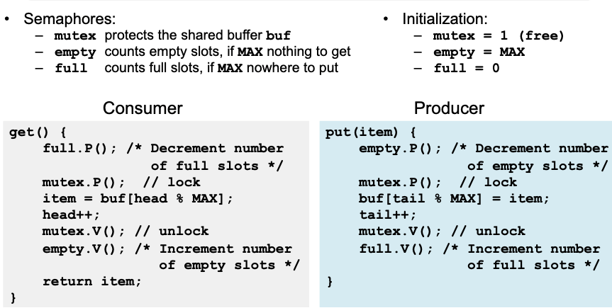
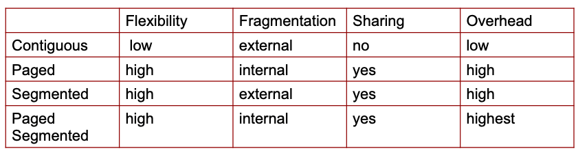
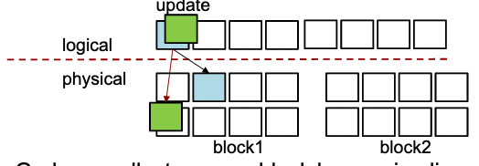

- #[[Operating Systems]]
	- ## Process Abstraction
		- A **process** is an instance of a program, running with limited "rights"
		- process $\ne$ program
			- a program is **passive entity** (executable file), while a process is **active entity** (has program counter indicating next instruction & set of allocated resources)
			- a program can have several processes
		- Process consists of two parts: address space and state
			- address space:
				- code, data, stack, heap
				- kernel stack
			- state (process control block or PCB):
				- registers, program counter, list of open files, etc.
	- ## Address Space Abstraction (Virtual Memory)
		- **Goals**:
			- Gives each process a private memory area for code, data, stack.
			- Prevent each process from reading/writing outside of its address space.
			- Allow sharing when needed.
		- **Implementation**:
			- OS manages address spaces, allocating physical memory.
			- HW performs address translation and protection, translating user addresses to physical addresses.
	- ## Process Control Block (PCB)
		- OS maintains information about every process in a data structure called a process control block (PCB).
		- Example of PCB in xv6
			- ```c
			  // Per-process state
			  struct proc {
			  	uint sz; 					// Size of process memory (bytes)
			  	pde_t* pgdir; 				// Page table
			  	char *kstack; 				// Bottom of kernel stack for this process
			  	enum procstate state;   	// Process state
			  	int pid; 					// Process ID
			  	struct proc *parent; 		// Parent process
			  	struct trapframe *tf; 		// Trap frame for current syscall
			  	struct context *context; 	// swtch() here to run process
			    	void *chan; 				// If non-zero, sleeping on chan
			  	int killed; 				// If non-zero, have been killed
			  	struct file *ofile[NOFILE]; // Open files
			  	struct inode *cwd; 			// Current directory
			  	char name[16]; 				// Process name (debugging)
			  };
			  ```
		- The OS has a **PCB table** that keeps track of the PCB for each process.
			- An array of PCBs
			- An array of pointers to dynamically allocated PCBs
	- ## Process States
		- As a process executes, it changes its state.
		- {:height 254, :width 441}
	- ## [[Dual-mode Operations]]
		- Allows sage instructions to execute directly on hardware
		- Represented by a single bit in processor status register which signifies what mode the processor is in
			- `user mode`: processor checks each instruction before executing to make sure it's allowed
			- `kernel mode`: processor doesn't need to check
	- ## Process [[Context Switch]]
		- Switching CPU from one process to another
			- Performed by the OS
		- Each process has a copy of the CPU state, which is the current contents of all of its registers, this allows processes to be paused and resumed at a later time
		- How to perform a [[Context Switch]]?
			- Save current process state
			- Load state of the next process
			- Continue execution of the next process
	- ## OS Kernel Structure
		- OS must provide many services to user level processes
		- Evaluating where the services should be located based on **performance**, **reliability/security**, and **flexibility**.
		- 
		- [[Monolithic Kernel]]
			- General features to make OS portable and extensible
			- **Hardware Abstraction Layer (HAL)**
				- Interface to machine configuration and processor-specific operations
				- Provide functions and abstract models of devices
				- To port OS to a new HW create new implementations of low-level HAL routines
			- **Dynamically loaded device drivers**
			- {:height 211, :width 423}
		- [[Layered Design]]
			- Requires lots of hardware
			- Simplicity of construction & debugging
			- Advantages: each layer implemented only use operations provided by the level below (secure)
			- Disadvantages: appropriately defining layers, less efficient
		- [[Microkernel Design]]
			- Removes all non-essential components from kernel
			- Kernel communicates between client programs and various services also running in user space
			- Advantage: makes extending operating system easier, more security & reliability.
		- [[Virtual Machine]]
			- Abstract hardware of single machine into several different execution environments
			- **Host**: underlying hardware system or OS
			- **Virtual Machine Manager (Hypervisor)**: Manages resources of host and provide abstraction for VMs. Runs with highest privilege.
			- **Guest**: Software running in VM.
	- ## Interrupts
		- Diverts current execution of program to predefined location in kernel to respond to an event.
		- ### HW Interrupts
			- Interrupts due to external events from the code.
			- **Maskable interrupts** can be disabled or ignored by CPU instructions
			- **Non-maskable interrupts** cannot be disabled by CPU instructions
		- ### SW Interrupts (Traps)
			- Generated by SW with special assembly instruction like a system call
			- Generated by CPU when math error
			- Generated by memory management unit (MMU) when page fault or segmentation fault
		- Interrupt Vector (stored in kernel)
			- A processor specific interrupt descriptor table that holds start addresses of the interrupt handler
		- ### CPU Fetch-Execute Cycle
			- {:height 345, :width 498}
	- ## System Calls
		- A process has both user-mode and kernel-mode context
			- User-mode context: register values when running in user mode + user-mode stack
			- Kernel-mode context: register values when running in kernel mode + kernel-mode stack
		- ### User and Kernel Stacks
			- Each process has two stack
				- user space stack: used when executing user code
				- kernel space stack: used when executing kernel code (e.g., during syscalls)
			- HW changes the stack pointer to point to the base of the kernel’s stack on trap or interrupt
			- Advantage: kernel can execute even if user stack is corrupted
			- On a multiprocessor, each processor has its own kernel (interrupt) stack
		- When syscall occurs, what stack is used?
			- On a syscall, the processor switches to the kernel stack, jumps to kernel mode, and starts executing the kernel instructions that implement the syscall
		- An interface between a user mode program and a service provided by the OS.
		- A pair of stubs (user stub and kernel stub) mediates between the user-level caller and the kernel's implementation of system calls.
		- The **user stub** is responsible for:
			- Filling in the code for the syscall
			- Pushing the argument and the syscall number on the stack
			- Executing the trap instruction
		- The **kernel stub** is responsible for:
			- Locating arguments
			- Copying arguments
			- Validating arguments
			- Copying results back into user memory
		- ## Process Management Syscalls
			- **fork**: create a copy of the current (parent) process, and start it (child) running - no arguments!
			- **exec**: change the program being run by the current process
			- **wait**: wait for a process to finish
			- **exit**: indicate that process is finished and ready to terminate
	- ## Concurrency in OS
		- Concurrency is the interleaving of processes (or threads) in time to give **the appearance of simultaneous execution**.
		- **Multiprogramming**: interleaved execution of two or more processes by a single CPU computer system.
		- **Multiprocessing**: simultaneous execution of two or more process by a computer having more than one CPU
		- ## Thread Abstraction
			- Decouple concurrency from protection and provide a familiar programming model
			- Thread is an OS abstraction of a CPU as exposed to programs
				- Each process needs at least one thread
			- A thread is a **single execution sequence** that represents a **separately schedulable** task
				- Process is a container in which threads execute: defines the address space that may be shared
				  by multiple threads
	- ## Synchronization
		- Use atomic (all or nothing) operations to ensure cooperation among threads and avoidance of [[race conditions]]
			- {{embed ((63363e48-efc2-452b-b5be-7dbe8eadbe0b))}}
			- **Synchronization** helps maintain data consistency
			- **Mutual exclusions** help avoid [[race conditions]].
				- A shared resource is only accessed by one thread at a time.
			- **Critical Sections**: code vulnerable to a race condition
		- **Mutexes (Locks)**
			- Rules:
			  1. thread should lock before entering critical section
			  2. thread should unlock when leaving  critical section
			  3. thread should wait if critical section is locked
			  4. when one thread hols a lock, no other thread can hold it
			  5. only one thread can access shared state at a time
			- Properties:
				- **Safety**: at most one thread holds lock
				- **Liveness**: `lock.acquire()` to get lock
				- **Bounded waiting**: if one thread $T$ tries to get a lock, there's a bound on the # of times other threads get lock before $T$ does
			- Implementation:
			  1. disables interrupts
			  2. RMW instructions support atomic and isolated action
		- **Condition Variable (CV)**
			- CV represents some condition that a thread can:
			  1. Wait on until the condition occurs
			  2. Notify other waiting threads that the condition has occurred
			- **Without CV threads have to continually poll to check if the condition is met.**
			- CV provides signaling (notification mechanism), not mutual exclusion
				- A mutex is needed to synchronize access to the shared data
				- Each CV is associated with a single mutex
			- `wait()` atomically unlocks the mutex and blocks the thread
			- `signal()` unblocks **one** of the threads waiting on CV
			- `broadcast()` unblocks **all** of the threads waiting on CV
		- **Semaphore**
			- A non-negative integer variable (counter) with two atomic operations and a queue.
			- `P() / down() / wait()` wait until counter value is $>0$, then atomically decrement the counter by 1
			- `V() / up() / signal()` increment counter value by 1, wake up one thread waiting in `P()`
			- Threads that are blocked (waiting) are placed in a queue
			- Counter keeps track of the number of threads that do not have to block
				- No thread can directly read the current value of the counter
			- ```
			  acquire semaphore with P()
			  critical section
			  release semaphore with V()
			  ...
			  ```
			- Semaphore has states, so `V()` in the absence of waiters allows next `P()` to immediately proceed
			- If initial semaphore value is $1$, semaphore acts as a mutex.
			- **Bounded Buffer using Semaphore**
			  
			- **Semaphore allows a resource to be concurrent accessed by at most $N$ threads at any time**
		- |Mutex|Conditional Variable|Semaphore|
		  |--|--|--|
		  |flag + waiting queue|waiting queue + signaling mechanism|counter + waiting queue + signaling mechanism|
		  |Mutual exclusion|Signaling|Signaling|
		  |When you want to allow a piece of code (critical section) to be executed by one thread at a time|Use it to avoid busy waiting for some condition to become true (requires mutex)|Allows multiple threads to access the finite number of resource instances|
		- **Rules**:
			- Always use locks and condition variables
			- Always acquire lock at beginning of procedure, release at end
				- Never acquire a lock in a parent thread and pass it to a child
			- Always hold lock when using a condition variable
				- Always wait in while-loop
			- Never call `sleep()` to have one thread wait for another thread to perform a task
				- wait on mutex or CV instead
			- 
	- ## DeadLock
		- A set of blocked threads each holding a resource and waiting to acquire a resource held by another thread.
		- All four of the following conditions must be true
			- **Bounded resources / mutual exclusion**: no deadlock when infinite resources
			- **No preemption**: resource ownership cannot be revoked.
			- **Hold and wait**: thread can hold a resource and wait for another resource
			- **Circular wait**: a set of threads where each thread waits for resource held by another thread
		- ### Handling Deadlocks
			- Ignore
			- Prevention: prevent any one of the four conditions from happening
			- Avoidance (predict the future): do not grant a resource request if this allocation might lead to deadlock
			- Allow it to happen --- Detection & recovery
		- ### Deadlock Avoidance
			- Avoid deadlock by keeping the system in a safe state while being **aggressive**
			- Banker's Algorithm
				- State maximum resource needs in advance
				- Allocate resources dynamically when resource is needed
					- Wait if granting request would lead to deadlock
				- Analyze resulting system state to see if it is "safe"
					- Request can be granted if some sequential ordering of threads is deadlock free
		- ### Deadlock Detection and Recovery
			- Wait-For Graph: A resource allocation graph containing only threads where each thread can have multiple incoming resource allocation edges but only one outgoing resource request edge
				- Edge $(A,B)$ means that $A$ is waiting for a $B$ to release a resource.
				- No Cycle $\implies$ no deadlock
				- Cycle $\implies$
					- if only one instance per resource type, then deadlock
					- if several instances per resource type, possibility of deadlock
			- Once a deadlock is detected, we have two options:
				- Abort threads
					- Restart all deadlocked threads
					- Restart one thread at a time until cycle is eliminated
				- Revoke resources (force their release)
					- Need to select thread and resource to preempt
					- Need to rollback thread to previous state
					- Need to prevent starvation
			- Transactions: rollback and retry
				- If deadlock occurs, pick some involved thread and roll it back
	- ## Memory Management
		- External Fragmentation: total memory space exists to satisfy a request, but it is not contiguous
		- Internal Fragmentation: allocated memory may be slightly larger than requested memory
		- 
		- ### Paging
			- Divide virtual memory and physical memory into fixed-sized blocks called **pages** and **frames**, respectively.
				- Pages and frames have same size
			- Virtual address generated by CPU is divided into:
				- Page number ($p$): index into a page table which contains base address of each page in physical memory
				- Page offset ($d$): offset within the page
			- Page size (likewise frame size) is always power of 2
				- For given virtual address space $2^m$ and page size $2^n$, high-order $m-n$ bits designate page number, and $n$ low-order bits designate the page offset.
			- **Address Translation**
				- Virtual page number to physical page frame translation is performed by Memory Management Unit (MMU)
				- Page table is an in-memory data structure that the MMU uses to look up
				- Each process has its own page table
					- Entries contain pointers to page frames
					- Stored in physical memory
	- ## Secondary Storage
		- HHD Access Time = Seek Time + Rotation Time + Transfer Time
		- SSD eliminates seek and rotational delay, but has limited write cycles
		- SSD cannot overwrite; must erase then write
			- Solution: Layer of indirection (Flash Translation Layer), Copy-on-Write
		- ### Flash Translation Layer (FTL)
			- SSD code that converts block I/O to internal operations
			- Map logical block address to physical page
				- 
			- Garbage collect erasure block by copying live pages to new location, then erase
				- 
			- Wear leveling: only write each physical page a limited number of times, remap pages that no longer work
	- ## File System
		- An operating system abstraction that provides persistent, named data.
		- Basic file system operations
			- `create`, `link`, `unlink`, `createdir`, `rmdir`
				- Create file, create a hard link to file, remove link
				- Create directory, remove directory
			- `open`, `close`, `read`, `write`, `seek`
				- Open/close a file for reading/writing
				- Seek resets current position
			- `fsync`
				- Forces modifications to disk
		- **File Sharing** on a multi-user system
			- User IDs identify users, allowing permissions to be per user
			- Group IDs allow users to be in groups, permitting group access rights
		- Directory maps filenames to file numbers (unique ID that is used to lookup physical disk location of a file)
		- Each process maintains the "current working directory"
		- ### Microsoft File Allocation Table (FAT)
			- An array of 32 bit entries (one entry per available block on disk)
			- File’s number is the index of the file’s first entry in the FAT
			- FAT is also used for free space tracking: if data block `i` is free, then `FAT[i]` contains 0
			- Grow file by allocating free blocks and linking them
			- Locality: next fit (next free block starting from the last block of the file
			- **Advantages**:
				- Simple
				- Easy to find free block
				- Easy to append to a file
			- **Disadvantages:**
				- Poor locality
				- Random access is very slow
				- Fragmentation
				- Limited metadata
				- No support for reliability and hard links
				- Max file size 4GB
		- ### UNIX FFS (Fast File System)
			- *inode* - root of asymmetric tree whose leaves are the data blocks of a file
				- 1 inode = 1 file
			- Multi-
			-
			-