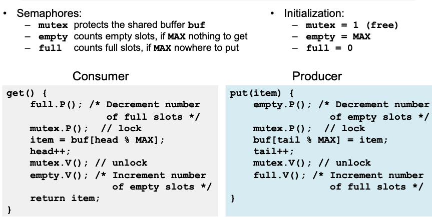
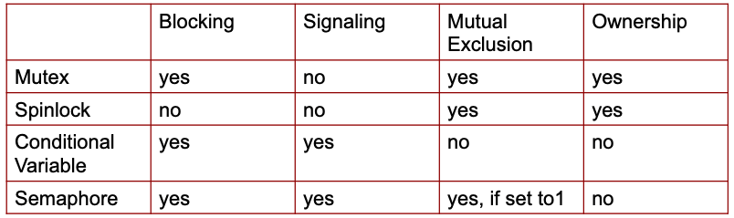
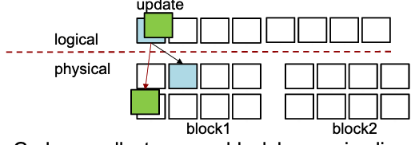
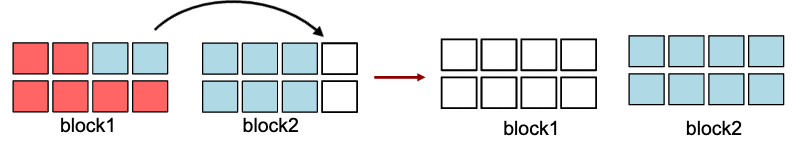
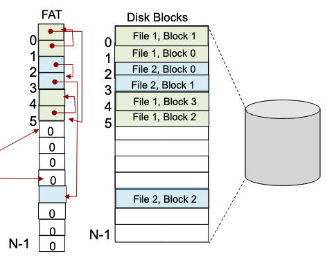

- #[[Operating Systems]]
	- ## Synchronization
		- Use atomic (all or nothing) operations to ensure cooperation among threads and avoidance of [[race conditions]]
			- {{embed ((63363e48-efc2-452b-b5be-7dbe8eadbe0b))}}
			- **Synchronization** helps maintain data consistency
			- **Mutual exclusions** help avoid [[race conditions]].
				- A shared resource is only accessed by one thread at a time.
			- **Critical Sections**: code vulnerable to a race condition
		- **Mutexes (Locks)**
			- Rules:
			  1. thread should lock before entering critical section
			  2. thread should unlock when leaving  critical section
			  3. thread should wait if critical section is locked
			  4. when one thread hols a lock, no other thread can hold it
			  5. only one thread can access shared state at a time
			- Properties:
				- **Safety**: at most one thread holds lock
				- **Liveness**: `lock.acquire()` to get lock
				- **Bounded waiting**: if one thread $T$ tries to get a lock, there's a bound on the # of times other threads get lock before $T$ does
			- Implementation:
			  1. disables interrupts
			  2. RMW instructions support atomic and isolated action
		- **Condition Variable (CV)**
			- CV represents some condition that a thread can:
			  1. Wait on until the condition occurs
			  2. Notify other waiting threads that the condition has occurred
			- **Without CV threads have to continually poll to check if the condition is met.**
			- CV provides signaling (notification mechanism), not mutual exclusion
				- A mutex is needed to synchronize access to the shared data
				- Each CV is associated with a single mutex
			- `wait()` atomically unlocks the mutex and blocks the thread
			- `signal()` unblocks **one** of the threads waiting on CV
			- `broadcast()` unblocks **all** of the threads waiting on CV
		- **Semaphore**
			- A non-negative integer variable (counter) with two atomic operations and a queue.
			- `P() / down() / wait()` wait until counter value is $>0$, then atomically decrement the counter by 1
			- `V() / up() / signal()` increment counter value by 1, wake up one thread waiting in `P()`
			- Threads that are blocked (waiting) are placed in a queue
			- Counter keeps track of the number of threads that do not have to block
				- No thread can directly read the current value of the counter
			- ```
			  acquire semaphore with P()
			  critical section
			  release semaphore with V()
			  ...
			  ```
			- Semaphore has states, so `V()` in the absence of waiters allows next `P()` to immediately proceed
			- If initial semaphore value is $1$, semaphore acts as a mutex.
			- **Bounded Buffer using Semaphore**
			  
			- **Semaphore allows a resource to be concurrent accessed by at most $N$ threads at any time**
		- |Mutex|Conditional Variable|Semaphore|
		  |--|--|--|
		  |flag + waiting queue|waiting queue + signaling mechanism|counter + waiting queue + signaling mechanism|
		  |Mutual exclusion|Signaling|Signaling|
		  |When you want to allow a piece of code (critical section) to be executed by one thread at a time|Use it to avoid busy waiting for some condition to become true (requires mutex)|Allows multiple threads to access the finite number of resource instances|
		- **Rules**:
			- Always use locks and condition variables
			- Always acquire lock at beginning of procedure, release at end
				- Never acquire a lock in a parent thread and pass it to a child
			- Always hold lock when using a condition variable
				- Always wait in while-loop
			- Never call `sleep()` to have one thread wait for another thread to perform a task
				- wait on mutex or CV instead
			- 
	- Occurs when two or more threads have conflicting access to
		- Memory location
		- Hardware device
		- File / OS-level resource
	- ## DeadLock
		- A set of blocked threads each holding a resource and waiting to acquire a resource held by another thread.
		- All four of the following conditions must be true
			- **Bounded resources / mutual exclusion**: no deadlock when infinite resources
			- **No preemption**: resource ownership cannot be revoked.
			- **Hold and wait**: thread can hold a resource and wait for another resource
			- **Circular wait**: a set of threads where each thread waits for resource held by another thread
		- ### Handling Deadlocks
			- Ignore
			- Prevention: prevent any one of the four conditions from happening
			- Avoidance (predict the future): do not grant a resource request if this allocation might lead to deadlock
			- Allow it to happen --- Detection & recovery
		- ### Deadlock Avoidance
			- Avoid deadlock by keeping the system in a safe state while being **aggressive**
			- Banker's Algorithm
				- State maximum resource needs in advance
				- Allocate resources dynamically when resource is needed
					- Wait if granting request would lead to deadlock
				- Analyze resulting system state to see if it is "safe"
					- Request can be granted if some sequential ordering of threads is deadlock free
		- ### Deadlock Detection and Recovery
			- Wait-For Graph: A resource allocation graph containing only threads where each thread can have multiple incoming resource allocation edges but only one outgoing resource request edge
				- Edge $(A,B)$ means that $A$ is waiting for a $B$ to release a resource.
				- No Cycle $\implies$ no deadlock
				- Cycle $\implies$
					- if only one instance per resource type, then deadlock
					- if several instances per resource type, possibility of deadlock
			- Once a deadlock is detected, we have two options:
				- Abort threads
					- Restart all deadlocked threads
					- Restart one thread at a time until cycle is eliminated
				- Revoke resources (force their release)
					- Need to select thread and resource to preempt
					- Need to rollback thread to previous state
					- Need to prevent starvation
			- Transactions: rollback and retry
				- If deadlock occurs, pick some involved thread and roll it back
	- ## Memory Management
		- External Fragmentation: total memory space exists to satisfy a request, but it is not contiguous
		- Internal Fragmentation: allocated memory may be slightly larger than requested memory
		- 
		- ### Paging
			- Divide virtual memory and physical memory into fixed-sized blocks called **pages** and **frames**, respectively.
				- Pages and frames have same size
			- Virtual address generated by CPU is divided into:
				- Page number ($p$): index into a page table which contains base address of each page in physical memory
				- Page offset ($d$): offset within the page
			- Page size (likewise frame size) is always power of 2
				- For given virtual address space $2^m$ and page size $2^n$, high-order $m-n$ bits designate page number, and $n$ low-order bits designate the page offset.
			- **Address Translation**
				- Virtual page number to physical page frame translation is performed by Memory Management Unit (MMU)
				- Page table is an in-memory data structure that the MMU uses to look up
				- Each process has its own page table
					- Entries contain pointers to page frames
					- Stored in physical memory
	- ## Secondary Storage
		- HHD Access Time = Seek Time + Rotation Time + Transfer Time
		- SSD eliminates seek and rotational delay, but has limited write cycles
		- SSD cannot overwrite; must erase then write
			- Solution: Layer of indirection (Flash Translation Layer), Copy-on-Write
		- ### Flash Translation Layer (FTL)
			- SSD code that converts block I/O to internal operations
			- Map logical block address to physical page
				- 
			- Garbage collect erasure block by copying live pages to new location, then erase
				- 
			- Wear leveling: only write each physical page a limited number of times, remap pages that no longer work
	- ## File System
		- An operating system abstraction that provides persistent, named data.
		- Basic file system operations
			- `create`, `link`, `unlink`, `createdir`, `rmdir`
				- Create file, create a hard link to file, remove link
				- Create directory, remove directory
			- `open`, `close`, `read`, `write`, `seek`
				- Open/close a file for reading/writing
				- Seek resets current position
			- `fsync`
				- Forces modifications to disk
		- **File Sharing** on a multi-user system
			- User IDs identify users, allowing permissions to be per user
			- Group IDs allow users to be in groups, permitting group access rights
		- Directory maps filenames to file numbers (unique ID that is used to lookup physical disk location of a file)
		- Each process maintains the "current working directory"
		- ### Design Challenges
			- Index structure: How do we locate the blocks of a file?
			- Index granularity: What block size do we use?
			- Free space: How do we find unused blocks on disk?
			- Locality: How do we preserve spatial locality?
			- Reliability (not discussed in class): What if machine crashes in the middle of a FS operation?
		- {:height 339, :width 629}
		- ### Microsoft File Allocation Table (FAT)
			- An array of 32 bit entries (one entry per available block on disk)
			- File’s number is the index of the file’s first entry in the FAT
			- FAT is also used for free space tracking: if data block `i` is free, then `FAT[i]` contains 0
			- Grow file by allocating free blocks and linking them
			- Locality: next fit (next free block starting from the last block of the file
			- 
			- **Advantages**:
				- Simple
				- Easy to find free block
				- Easy to append to a file
			- **Disadvantages:**
				- Poor locality
				- Random access is very slow
				- Fragmentation
				- Limited metadata
				- No support for reliability and hard links
				- Max file size 4GB
		- ### UNIX FFS (Fast File System)
			- fixed-depth asymmetric tree where leaves are data blocks of file & internal nodes provide indirection to support larger files.
			- *inode* - root of asymmetric tree whose leaves are the data blocks of a file
				- 1 inode = 1 file
			- 
			- FFS volume is divided into a set of block (cylinder) groups
			- Optimized for the common case:
				- File's data blocks, data and metadata, and different files from the same directory are accessed together
				- Files in the same directory located in the same group
				- **Advantages**:
					- Efficient storage for small files
					- Efficient lookup for random access in large files
					- Locality for large files
					- Locality for metadata and data
				- **Disadvantages**:
					- Inefficient for tiny files
					- Inefficient encoding when file is mostly contiguous on disk
					- Need to reserve some free space to prevent fragmentation
		- ## Microsoft New Technology File System (NTFS)
			- Uses extents to store data, has a master file table, and each file is represented by a variable depth tree.
			- **Advantages**:
				- Efficient storage for large files
				- Support for very large files
				- Support for file permissions
				- Reliability
			- **Disadvantages**:
				- Space and management overhead
				- Not suitable for small drives
		- ### Copy-On-Write (COW) File Systems
			-
-