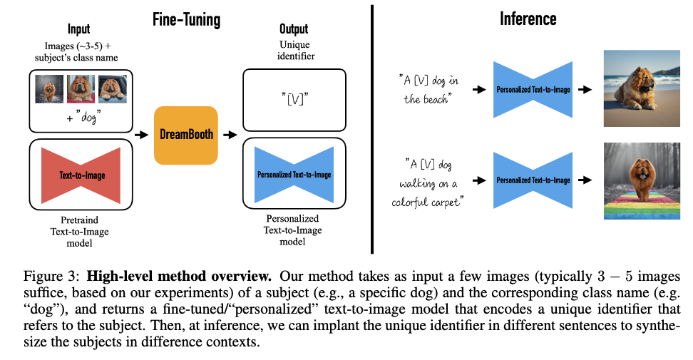

source:: https://arxiv.org/pdf/2208.12242.pdf
github:: https://github.com/XavierXiao/Dreambooth-Stable-Diffusion

- **Objective: subject-driven generation**
	- Given a few (3-5) casually captured images of a subject, the goal is to synthesize novel renditions of the subject in different contexts, while maintaining high fidelity to its key visual features.
- A new technique for fine-tuning text-to-image diffusion models in a few-shot setting, while preserving the
  model’s semantic knowledge on the class of the subject.
- Examples of output variations include: changing the place where the subject is, changing a property of the subject such as color, species, or shape, and modifying the subject’s pose, expression, material, and other semantic modifications.
- ## Method
	- {:height 378, :width 666}
	- The DreamBooth pipeline mainly consist of the following:
		- **Input**: images of a particular subject + the corresponding class name
		- **Regularization**: generate regularization images of the corresponding class name using pre-trained Text-to-Image model
		- **Fine-tuning**: fine-tune the pre-trained Text-to-Image model based on **regularization** images and **input** images to generate a *personalized* Text-to-Image model
		- **Super-Resolution**
		- **Inference**