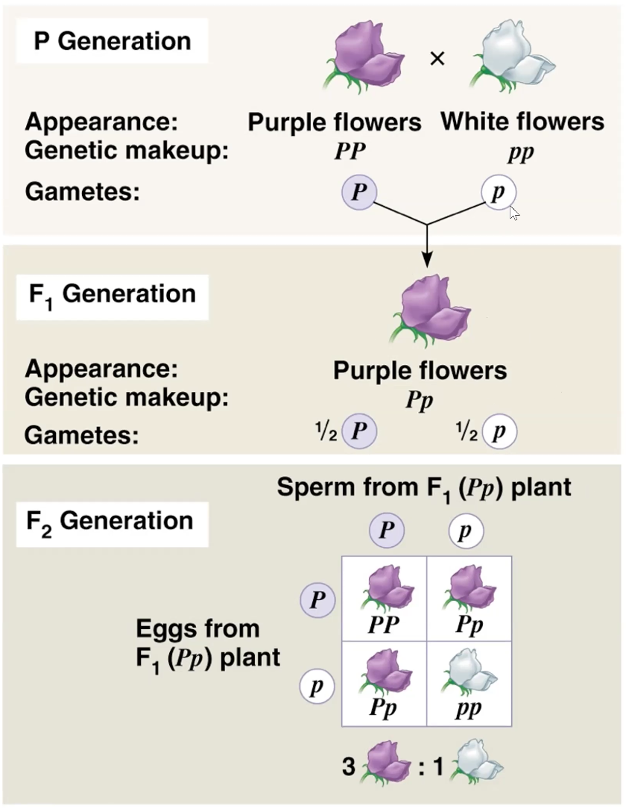

title:: General Biology: Organismal Biology and Evolution (120)

- What is [[science]]?
- How to differentiate science from pseudoscience?
- What is the [[Scientific Method]]?
- [[Experimentation]]
- [[Observation]]
- What is [[hypothesis testing]]?
- What is a proper [[scientific hypothesis]]?
  collapsed:: true
	- proposed explanation for a scientific question
	- must be **testable**; more specifically it should be **falsifiable**
	- Other scientists should be able to **reproduce** the results by following the same procedure
- What can the results of an experiment do to its hypothesis?
  collapsed:: true
	- It can either **support** or **falsify** the explanation.
- What are [[Independent Variable]], [[Dependent Variable]], and [[Controlled Variable]]?
- What is the [[Null Hypothesis]] method for [[hypothesis testing]] ?
  collapsed:: true
	-
	  > Minimize the probability of rejecting the null, if the null is true.
- What is the difference between **facts** and **hypothesis** in [[science]]?
- What is the relation between a [[scientific theory]] and hypotheses?
- [[ Theory of Evolution]]
- What is [[pseudoscience]]?
  collapsed:: true
	- Not testable or reproducible OR already falsified.
- What is life ([[living organisms]])?
- Is [[bacteria]] (sing. bacterium) an organism?
- Is [[viruses]] an organism?
- What makes up an individual living organism?
  collapsed:: true
	- The [[cell]] is the smallest unit of organization that can perform all activities required for life
- Two main types of [[cell]]?
  collapsed:: true
	- [[Eukaryotic Cell]]
	- [[Prokaryotic Cell]]
- What is blending inheritance and what is particulate inheritance?
  collapsed:: true
	- Blending: the idea that genetic material contributed by the two parents mixes in a manner analogous to the way blue and yellow paints blend to make green
	- Particulate: parents pass on discrete heritable units (genes) that retain their separate identities in offspring; i.e., more like a deck of cards than a pail of paint
- Who tested the hypothesis about blending and particulate?
	- [[Gregor Mendel]]
- What is [[Mendel's Model]] of inheritance?
  collapsed:: true
	- {:height 456, :width 349}
- Difference between [[Genotype]] and [[Phenotype]]?
- What is difference between [[Homozygous]] and [[Heterozygous]]?
- What is [[DNA]]?
- What is [[RNA]]?
- What is the difference between [[DNA]] and [[RNA]]?
- What are [[chromosomes]]?
- What are [[genes]]?
- What is the locus?
- How do genes code for characteristics?
- Genes code for proteins
	- Polymers of amino acids = polypeptides
- What are [[proteins]]?
	- proteins are constructed from amino acids.
	- nearly every dynamic function of a living being depends on proteins
- How is mRNA translated into amino acids?
- What is mRNA?
- What is tRNA?
- What is codominance?
  collapsed:: true
	-
	  $$I^AI^A \times I^BI^B = I^AI^B$$
	- type A $\times$ type B = type AB
- What is incomplete dominance?
  collapsed:: true
	-
	  $$C^RC^R \times C^BC^B = C^RC^B$$
	- red $\times$ blue = purple
- What about a cross involving multiple characters?
- What is [[mitosis]]?
- What is [[meiosis]]?
- What do we mean by evolutionary relationship?
- What is the grouping categories (Linneaus)?
	- Class > Order > Family > Genus > Species
## [[Theory of Natural Selection]]
- 
- What are the three main components in Darwin-Wallace [[Theory of Natural Selection]]?
  collapsed:: true
	- Variation in traits
	- Hearitability of traits
	- Selection results from differential reproductive success
	-
	  > We say that individuals with higher reproductive success have higher [[biological fitness]]
- Individuals do not evolve. It is the population that evolves over time.
- Evidence supporting Darwin-Wallace [[Theory of Natural Selection]]
  collapsed:: true
	- Biogeography of closely related spp.
	- Fossils
	- Embryology - homologies, vestigial organs
	- Also, Darwin emphasized similarities to [[Artificial Selection]].
- [[three-spined stickleback]]
  collapsed:: true
	- Shows significant morphological change within a few thousand years
- 
- What are the forces of Evolutionary Change in a population?
  collapsed:: true
	- Natural Selection
	- Sexual Selection
	- Genetic Drift
	- Gene Flow
	- Mutation
- What is the impact of natural selection on a population?
  collapsed:: true
	- ((613f0e97-fae9-4792-9158-59e3d8dd6e45))
- Different modes of natural selection:
  collapsed:: true
	- ((613f0f27-49e8-48c6-8128-07be0a813a05))
	- [[Stabilizing selection]]
	  collapsed:: true
		- ((613f0f47-1f89-4c5c-894c-b32ea05c1d9a))
	- [[Directional selection]]
	  collapsed:: true
		- ((613f0f6c-c171-4917-836f-cd49e6ae60c1))
	- [[Disruptive selection]]
	  collapsed:: true
		- ((613f1001-4879-4744-be2f-3d4575877a31))
- What is [[Mutation]]?
	- Mutations produce new variations
	- Often caused by [[DNA polymerase]] errors in DNA synthesis (or DNA repair)
	- Mutations can be spontaneous errors or caused by [[mutagens]]
- Difference between [[large scale mutation]] and [[small scale mutation (point mutation)]] #Mutation
	- ((613f1149-eb5a-40b1-87fb-9ebf1e910379))
- What is [[gene flow]]? ((613f13c9-64c5-4c0e-8250-5018eee3cc1f))
- What is [[genetic drift]]?
## Sexual Reproduction and Sexual Selection
- 
- Microorganism typically reproduce through simple mitosis, some [[asexual reproduction]] (multicellular) happens by [[budding]], offspring are clones of its parents.
- How do we define biological sex?
	- In biology, defined by having gonads that can produce **eggs** or **sperm**.
	- In mammals, males always have XY chromosomes, while females have XX.
	- There is an enormous amount of variation in other animals and plants (e.g. birds: females XY; crocodiles: temperature, not chromosomes)
-