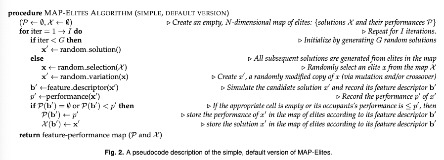

- #[[MAP-Elites]]
- [[MAP-Elites]] (1) illuminates the relationship between performance and dimensions of interest in solutions, (2) returns a set of high-performing, yet diverse solutions, and (3) improves the state-of-the-art for finding a single, best solution, it will catalyze advances throughout all science and engineering fields.
- [[Novelty Search]]: an algorithm that abandons the goal of improving performance altogether, and instead select only for diversity in the feature space.
	- Performs better than performance-driven search on deceptive problems
	- How about standard (non-deceptive) problems? #Questions
	- > The user defines how to measure the distance between behaviors, and then Novelty Search seeks to produce as many different behaviors as possible according to this distance metric. The algorithm stops when an individual in the population solves the objective (i.e. their performance is high enough).
	- Does not work well with very large feature/behavioral spaces.
- ## [[Multi-dimensional Archive of Phenotypic Elites]]
	- Allowing  users to **create diversity in the dimensions of variation** they choose.
	- Illuminating the fitness potential of the entire feature space, not just the high-performing areas, revealing relationships between dimensions of interest and performance.
	- **Improved optimization performance**; the algorithm often finds a better solution than the current state-of-the-art search algorithms in complex search spaces because it explores more of the feature space, which helps it avoid local optima and thus find different, and often better, fitness peaks.
	- The search for a solution in any single cell is **aided by the simultaneous search for solutions in other cells**.
		- It may be more likely to generate a solution for one cell by mutating a solution to a more distant cell, a phenomenon called “goal switching” in a new paper that uses MAP-Elites
		- It may be more likely to produce a solution to a cell by crossing over two solutions from other cells
	- Returning a large set of diverse, high-performing individuals embedded in a map that describes where they are located in the feature space, which can be used to create new types of algorithms or improve the performance of existing algorithms
- [[optimization algorithms]] are not traditionally designed to report the highest-performing solution possible in an area of the feature space that cannot produce either the highest-performing solution overall, or a solution on the Pareto front.
- [[illumination algorithms]] are designed to return the highest-performing solution at each point in the feature space.
	- Note that [[illumination algorithms]] is a **superset** of [[optimization algorithms]]
- [[Multi-dimensional Archive of Phenotypic Elites]] is a [[illumination algorithms]] inspired by [[Novelty Search]] + [[Local Competition]] and the [[Multi-Objective Landscape Exploration algorithm (MOLE)]]
- ## Details of the [[Multi-dimensional Archive of Phenotypic Elites]] algorithm
	- Choose a performance measure $f(x)$ that evaluates a solution $x$.
	- Choose $N$ dimensions of variation of interest that define a _feature space_ of interest to the user.
	- 
	- We exhibit a feature function $b(x)$, where $b(x)$ returns $b_x$, which is an $N$-dimensional vector describing $x$'s features.
		- With _direct encoding_, each element in the genome specifies an independent component fo the phenotype.
		- With _indirect encoding_, information in the genome can be reused to affect many parts of the phenotype; such encodings have been shown to improve **regularity**, **performance**, and **evolvability**.
	- [[Multi-dimensional Archive of Phenotypic Elites]] starts by randomly generating $G$ genomes and determining the performance and features of each. These genomes are placed into the cells to which they belong in the feature space.
	- Then, the following steps are repeated until a termination criterion (a set amount of time, a fixed amount of computational resources, or some property of the archive) is reached.
		- A cell in the map is randomly chosen and the genome in that cell produces an offspring via **mutation** and/or **crossover**.
		- The features and performance of that offspring are determined, and the offspring is placed in the cell if the cell is empty or if the offspring is higher-performing than the current occupant of the cell, in which case that occupant is discarded.
	- Note that:
		- It is not guaranteed that all cells in the feature space will be filled.
		-
	-