- #[[University of Southern California (USC)]] #[[B.S. Computer Science]] #[[B.S. Applied and Computational Mathematics]]
- What is an [[Algorithmic Problem]]?
  collapsed:: true
	- Compute some function of "input data", "efficiently."
	- [[Decision Problems]]
	- [[Optimization Problems]]
	- [[Search Problems]]
## [[The Stable Matching Problem]]
- What is the [[Gale-Shapley Algorithm]]?
- How many iteration before the [[Gale-Shapley Algorithm]] terminates?
  collapsed:: true
	-
	  > It is not guaranteed that the runtime of the [[Gale-Shapley Algorithm]] is $O(n^2)$, as the **runtime per iteration** may vary.
- How to guarantee that each iteration of the [[Gale-Shapley Algorithm]] takes constant time?
- Prove: Consider an execution of the [[Gale-Shapley Algorithm]] that returns a set of pairs $S$. The set $S$ is a stable matching.
- Five Representative Problems
  collapsed:: true
	- [[Interval Scheduling]]
	- [[Weighted Interval Scheduling]]
	- [[Bipartite Matching]]
	- [[Independent Set]]
	- [[Competitive Facility Location]]
## Greedy Algorithm
- What is some characteristics of [[Greedy Algorithm]]?
	- Builds solution in small steps
	- Each step optimizes some myopic criterion
	- Does not backtrack/reverse decision
### The [[Interval Scheduling]] Problem
	- What is the greedy criteria?
	  collapsed:: true
		- Earliest Finish Time
		- "I want to finish every tasks ASAP, so I can leave more time for the later tasks"
	- The Algorithm
	  collapsed:: true
		- $R =T, A = \phi$
		- While $R \ne \phi$
			- $i = \text{argmin} f(j): j \in R$
			- $A = A \cup \{i\}$
			- Remove from $R$ all tasks overlapping $i$.
		- EndWhile
		- Return $A$
	- How to prove optimality?
		- $A$ is the solution output by our algorithm
		- $O$ is the optimal solution
		- Denote $k = |A|, m = |O|$, obviously $k \le m$
		- We will show that $k = m$ (our solution is **an** optimal solution)
	- Proof
		- Let $A = \{i_1, \dots, i_k\}$ in order by finish time
		- Let $O = \{j_1, \dots. j_m\}$ in order by finish time.
		-
		  > $i_t$ is task added in iteration $t$
		- Lemma (Greedy stays ahead): $f(i_t) \le f(j_t), \forall t = 1, \dots, k$
		- B.C.: $t=1$
		- I.H.: Assume true for $t$
		- I.S.: Prove for $t+1$
			- $S(j_{t+1}) \ge f(j_t) \ge^{IH} f(i_t)$
			- $j_{t+1} \in R$ at iteration $t+1$
			- Since $i_{t+1}$ is earliest finishing tasks in $R$ during iteration $t+1$
			-
			  $$f(i_t + 1) \le f(j_t+1)$$
	- Earliest Finish Time: the proof, using the [[Exchange Argument]]
		- B.C.: There is an optimal solution that includes EFT's first 0 choices (vacuously true).
		- I.H.: There is an optimal solution OPT that includes EFT's first $k$ choices.
		- I.S.: Assume that OPT does not include EFT's $(k+1)$st choice
			- Sort OPT's intervals by finish time: EFT's first $k$ choices must be the first $k$ intervals in this sorting.
			- Let interval $j$ be the $(k+1)$st interval in this sorting, and let interval $i$ be EFT's $(k+1)$st choice.
				- Since EFT always pick the interval with the earliest finish time, $f_i < f_j$
			- Transform OPT into OPT' by replacing interval $j$ with $i$.
			- Since $i$ starts after the $k$th interval in the sorting finishes, and finishes before $j$ did, this must be a valid solution.
-
-
## 5/19: Introduction
	- [[The Famous Person Problem]]
	  collapsed:: true
		- Person $p$ is **famous** iff everyone in this class knows *p*, but *p* knows no one else in this class.
		- A single *query* consists of taking a pair of people $<p, q>$ from the class, asking if $p$ knows $q$, and receiving a response.
		- You want to determine all the famous people in a class of size $n$, using the minimum possible number of queries.
		- How would we test this hypothesis? 
		  collapsed:: true
			- For every person in the class, ask if they know me, and if I know them. If any queries fail, I'm not famous. Otherwise, I am.
		- How would we alter our test to find all famous people in the class?
		  collapsed:: true
			-
			  ```cpp
			  			  			  			  			  			  			  			  			  			  For all people in the class p
			  			  			  			  			  			  			  			  			  			  	For all people in the class q, where p != q
			  			  			  			  			  			  			  			  			  			    	If p knows q, then p is not famous
			  			  			  			  			  			  			  			  			  			    	If q doesn't know p, then p is not famous
			  			  			  			  			  			  			  			  			  			    If p is famous, add p to the list
			  			  			  			  			  			  			  			  			  			  Return our list
			  			  			  			  			  			  			  			  			  			  ```
			- How many queries does this algorithm use, exactly?
			  collapsed:: true
				- $2n(n-1)$
		- How can we improve our algorithm?
		  collapsed:: true
			- We’re asking each query twice.  If we are clever about how we organize our queries, we can reduce this to $n  \ne (n-1)$ (or, $n \text{ permute } 2$) queries.
			- The queries are "does $q$ know $p$?", and "does $p$ know $q$?". However, eventually $p$ and $q$ switches value, so we are asking the same queries twice.
		- How many famous people can there be, maximum?
		  collapsed:: true
			- One. Two would have to both know and not know each other, so we can stop the algorithm after finding our first famous person.
		- An even better solution:
		  collapsed:: true
			- If $p$ knows $q$, then we know that $p$ is not famous.
			- If $p$ does not know $q$, then we know that $q$ is not famous.
			-
			  1. Maintain a list of famous candidates, initially everyone
			  2. Take any pair $<p, q>$ from the list, or go to step 5
			  3. Check if $p$ knows $q$. If so, remove $p$. Otherwise, remove $q$.
			  4. Return to step 2
			  5. There is one person on the list now: $c$
			  6. For all people $q \ne c$:
				- Check if $c$ knows $q$. If so, return `nullptr`.
				- Check if $q$ knows $c$. If not, return `nullptr`.
				-
				  7. Return $c$.
				- But $c$ is not necessarily famous.
				- Improve the algorithm for the Famous Person Problem to require only $3 \cdot (n-1) - \log_2 n$ queries.
				- Prove that the Famous Person Problem cannot be solved with less than $\Theta(n)$ queries.
				  collapsed:: true
				- To determine for sure whether a candidate $p$ is for sure a famous person, we have to ask if $p$ knows $q$ for each $q$ in the class, which will take $n-1$ time. Thus, we will always have to ask at least $\Theta(n)$ queries.
				  collapsed:: true
## 5/20: Proof and Runtime
	- Prove by contradiction: if $n^2$ is odd, then $n$ is odd.
	  collapsed:: true
		- Assume that $n^2$ is odd and $n$ is even.
		- $n = 2k$
		- Therefore, $n^2 = 4k^2$, which is even. Contradiction!
	- Prove by contradiction: there are an infinite number of primes.
	  collapsed:: true
		- Assume that there are a finite number of primes.
		- Therefore, there is a largest prime, $p$.
		- $p!$ is divisible by all primes $\le p$
		- Therefore, $p! + 1$ is divisible by no primes $\le p$
		- However, Every number has a prime factorization, so either $p! + 1$ is prime (and larger than $p$) or its prime factorization contains primes only larger than $p$. Contradiction!
	- Prove or disprove: for any sets $A$, $B$, and $C$, if $A \times C = B \times C$, then $A = B$. 
	  collapsed:: true
	  $(A\times B = \{\langle a,b \rangle : a \in A, b \in B\})$
		- Wrong Proof:
		  collapsed:: true
			- Assume $A \times C = B \times C$, but $A \ne B$
			- There must be an element in one of $A$ or $B$ which is not in the other set.
			- Without loss of generality, assume $a \in A$, but $a \not\in B$
			- Choose an arbitrary element $c \in C$
			  id:: 60a7b70a-4dee-4f36-b675-5c79c6547d60
			- $\langle a,c \rangle \in A \times C$, but $\langle a,c \rangle \not\in B \times C$, contradiction!
		- However, when we said: ((60a7b70a-4dee-4f36-b675-5c79c6547d60)), we falsely assumed that there is an element in $C$.
		- Correct Proof:
		  collapsed:: true
			- Counter-example: when $C = \phi$, $A \times C = B \times C$ even when $A \ne B$.
	- Proof by [[Induction]]: find the flaw in the proof that $a^n=1$, for all non-negative integers $n$ and all non-zero reals $a$.
	  collapsed:: true
		- _Base Case_: $a^0 = 1$
		- _Inductive Hypothesis_: $a^n = 1$, for all $n \le k$
		- _Inductive Step_: $a^{k+1} = \frac{a^k \cdot a^k}{a^{k-1}} = 1$, by the inductive hypothesis
		- **The problem**: When we are looking at $k = 0$, because it refers to $a^{-1}$, which we haven't proven (and can't).
	- Runtime of Mergesort
	  collapsed:: true
		- $f(n) = 2 \cdot f(n/2) + x \cdot n, f(1) = y$
		- Hypothesize that $f(n) \le c \cdot n \log n$, for all $n \ge 2$
		- _Base Case_: We need $f(2) = 2 \cdot y + 2 \cdot x \le 2 \cdot c$. Choose $c$ to be $\ge x + y$.
		- _Inductive Step_: by the inductive hypothesis, 
		  $$
		  f(k + 1) = 2 \cdot f(\frac{k+1}{2}) + x \cdot (k+1) \le 2c \cdot \frac{k+1}{2} \log \frac{k+1}{2} + x \cdot (k+1) \\
		  = c(k+1)[\log(k+1) - 1] + x(k+1) \\
		  = c(k+1)\log(k+1) + (x - c)(k+1)
		  $$
		- So the claim is true when $(x-c)(k+1) \le 0$, which is true when $c \ge x$
		- It is, since we already chose $c$ to be $\ge x + y$. Proven!
		- Does this prove that Mergesort takes $Theta(n \log n)$?
			- No, we only showed $O(n\log n)$. We'd need another proof to show $\Omega(n \log n)$
		- Is it valid to use $n=2$ as the base case?
			- Yes, because O-notation asserts the claim is true for all $n \ge n_0$. We can choose $n_0 = 2$.
	- Solve-by-tree
	  collapsed:: true
		- $f(n) = 2f(n/2) + cn, f(1) = d$
		- 
		  collapsed:: true
## 5/21: [[Master Theorem]]
	- What can [[Master Theorem]] do?
	  collapsed:: true
		- Master Theorem can solve (almost) any recurrence relation of the form
		- $f(n) = a \cdot f(n/b) + g(n)$, for constants $a \ge 1$ and $b > 1$
	- Using the [[Master Theorem]]:
	  collapsed:: true
		- Given $f(n) = a \cdot f(n/b) + g(n)$, for constants $a \ge 1$ and $b > 1$, compare $g(n)$ with $n^{\log a / \log b}$
			- Case 1: If $g(n) = \Theta(n^{\log a / \log b})$, then $f(n) = \Theta(g(n) \cdot \log n)$
			- Case 2: If $g(n) = \Omega(n^{(\log a / \log b) + \epsilon})$ for some $\epsilon > 0$, then $f(n) = \Theta(g(n))$
			- Case 3: If $g(n) = O(n^{(\log a / \log b) - \epsilon})$ for some $\epsilon > 0$, then $f(n) = \Theta(n^{\log a / \log b})$
	- More Precise Interpretation of [[Master Theorem]]
	  collapsed:: true
		- If the work done on the bottom level is a **polynomial-factor** bigger than the work on the top level, then the total work is the work on the bottom level.
		- If the work done on the top level is a **polynomial-factor** bigger than the work on the bottom level, then the total work is the work on the top level.
		- If the difference between the top and bottom level is greater than a constant, but smaller than a polynomial, then master theorem **will not help us**.
	- What is [[Amortized Runtime]]?
	  collapsed:: true
		- It is a blend between average-case and worst-case. It is kind of the "worst-case average-case".
	- [[Take-Home Practice]]:
	  collapsed:: true
		- Prove for all integers $n$: $n$ is odd iff $3n+1$ is even.
		  collapsed:: true
			- If $n$ is odd, then $3n+1$ is even.
				- $n = 2k+1$
				- $3(2k+1)+1 = 6k+3+1 = 6k+4 = 2(3k+2)$, which is even.
			- If $3n+1$ is even, then $n$ is odd.
				- Contrapositive: If $n$ is even, then $3n+1$ is odd.
				- $n = 2k$
				- $3n+1 = 3(2k)+1 = 6k+1$, which is even.
		- Use induction to prove that $\sum^n_{i=1} \frac{1}{2^i} < 2$
		  collapsed:: true
			- Prove that $\sum^n_{i=1} \frac{1}{2^i} = 1 - \frac{1}{2^i}$
			- _B.C._: For $n = 1$, $\sum^1_{i=1} \frac{1}{2^i} = \frac{1}{2}  = 1 - \frac{1}{2^1}$
			- _I.H._: Assume $\sum^n_{i=0} \frac{1}{2^i} = 1 - \frac{1}{2^i}$ for $1 \le n \le k$
			- _I.S._: Consider $n = k + 1$, 
			  $$
			  \sum^{k+1}_{i=1} \frac{1}{2^i}  = \frac{1}{2^{k+1}} + \sum^{k}_{i=1} \frac{1}{2^i} \\
			  \text{By I.H.:} \sum^{k+1}_{i=1} \frac{1}{2^i} = \frac{1}{2^{k+1}} + 1 - \frac{1}{2^k} = 1 + \frac{1}{2^k}(\frac{1}{2} - 1) = 1 - \frac{1}{2^{k+1}}
			  $$
			- By induction, $\sum^{k+1}_{i=1} \frac{1}{2^i} = 1 - \frac{1}{2^{k+1}}$, since $\frac{1}{2^{k+1}}$ is positive, we proved that the sum of sequence is less than 2.
		- Ch. 2, Ex. 3
		  collapsed:: true
			- 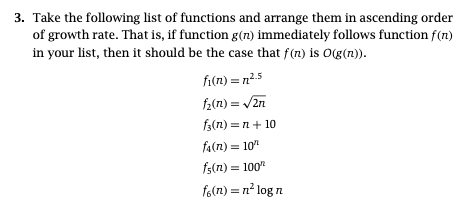
			- $f_2, f_3, f_6, f_1, f_4, f_5$
			  background-color:: #264c9b
			- $f_1, f_2, f_3, f_6$ are polynomials. To compare polynomials, we just need to check the exponent on $n$.
			- $f_4, f_5$ are exponentials. $f_5$ is clearly larger than $f_4$.
		- Ch. 2, Ex. 4
		  collapsed:: true
			- 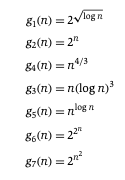
			- $g_1, g_3, g_4, g_5, g_2, g_7, g_6$
			  background-color:: #264c9b
			- Take logarithm of all functions and compare them.
		- Ch. 2, Ex. 5
		  collapsed:: true
			- Given that $f(n) = O(g(n))$, this means that $f(n) \le C_1g(n)$ for $n > x_1$
			- Prove or disprove: $\log f(n) = O(\log g(n))$
			  collapsed:: true
				-
				  $$ 
				  \log f(n) \le \log(C_1g(n))) = \log C_1 + \log g(n) \\
				  \log f(n) \le \log g(n) + C_2 \text{ for } n \ge x_1 \\
				  \log f(n) = O(g(n))
				  $$
			- Prove or disprove: $2^{f(n)} = O(2^{g(n)})$
			  collapsed:: true
				- False. Counter example: $\log n^2 = O(\log n)$, but $2^{\log n^2} \ne O(2^{\log n})$ since $n^2 \ne O(n)$
			- Prove or disprove: $f(n)^2 = O(g(n)^2)$
			  collapsed:: true
				- $f(n)^2 \le C^2_1 g(n)^2$. Since $C^2_1$ is still a constant, $f(n) = g(n)$
		- Ch. 2, Ex. 6
			- 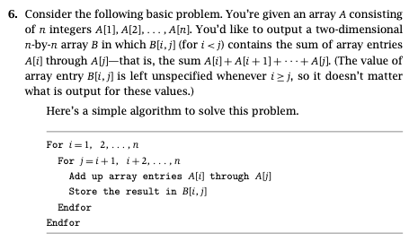
			- 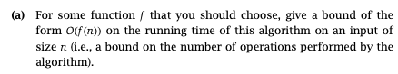
			  collapsed:: true
				- $O(n^3)$, since there is 3 loops that goes up to $n$.
			- 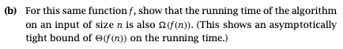
				-
			- (c) Find a better algorithm to solve this problem, with a better runtime
			  collapsed:: true
				- `B[i,j]` is the sum of `A[i]` though `A[j]`
				- For the first iteration of the inner for loop, we store `A[i] + A[j]` in `B[i,j]` (note that `j = i+1` by the nature of the for loop)
				- For all remaining iterations of the inner for-loop, we just add `B[i, j-1]` (the sum of `A[i]` through `A[j-1]`) with `A[j]`, storing the result is `B[i,j]`.
		- Challenge: Chapter 2, exercise 8
		- Solve the following recurrence relations:
		  collapsed:: true
			- $f(n) = f(n/4) + \sqrt{n}$
				- By [[Master Theorem]], $f(n) = \Theta(\sqrt{n})$
			- $f(n) = f(n/4) + 1$
				- By [[Master Theorem]], $f(n) = \Theta(\log n)$
			- $f(n) = f(n/4) + \log n$
				- $\log n$ and $1$ does not difference by more than a polynomial factor. Therefore, [[Master Theorem]]  won't work there.
				- Use solve-by-tree.
## 5/24: [[Union-Find ADT]]
	- [[Spanning Tree]]
	  collapsed:: true
		- Given a connected, undirected graph $G$, a **spanning tree** is a subset of the edges which form a tree on the original nodes.
	- [[Minimum Spanning Tree]]
	  collapsed:: true
		- Given a connected, undirected graph $G$, a **minimum spanning tree** is the [[Spanning Tree]] which minimizes the sum of the edge weights.
	- Kruskal's Algorithm
	  collapsed:: true
		- [[Kruskal's Algorithm]] adds edges from smallest to largest value, unless adding an edge creates a cycle. It provably find the [[Minimum Spanning Tree]] .
	- Implementing [[Kruskal's Algorithm]]
	  collapsed:: true
		- What would be the first step in the implementation of Kruskal's Algorithm?
		  collapsed:: true
			- Sort the edges.
		- What is the runtime of this step?
		  collapsed:: true
			- $\Theta(m \log m)$
		- How do we determine if an edge creates a cycle?
		  collapsed:: true
			- When adding edge $\langle u,v \rangle$, run BFS or DFS from $u$ on the MST-so-far to see if there is already a path from $u$ to $v$. If so, don't add the edge.
		- What's the runtime of this implementation?
		  collapsed:: true
			- $\Theta(mn)$. We can do better, but we're going to need a new data structure.
	- What operations do the [[Union-Find ADT]] support?
	  collapsed:: true
		- `Find(v)`, which returns which componenet node $v$ is in. If `Find(u) == Find(v)`, then we don't want to add edge $\langle u, v \rangle$.
		- `Union(u,v)`, which combines the components of node $u$ and node $v$ into the same component. We use this when we add edge $\langle u, v \rangle$.
	- 
	- Runtime of [[Kruskal's Algorithm]]
	  collapsed:: true
		- Sorting takes $\Theta(m \log m)$
		- `Find` is called $2m$ times
		- `Union` is called $n-1$ times, because there is at most $n-1$ edges on the graph
		- Runtime $= \Theta(m \log m + m \cdot Find + n \cdot Union)$
	- Implementing Union-Find
	  collapsed:: true
		- Every node points to a "parent" node that is in the same component.
		- The root of the component has no parent, and is the "captain", or "identifier", of the component.
		- Runtime
			- Union will be $\Theta(1)$, since we just assign the parent pointer.
			- Find will potentially be $\Theta(n)$, if the parent pointers form a linked list.
		- How could we modify Union to ensure the runtime of Find is minimized
			- Always point the smaller-depth tree to the larger depth tree.
			- By doing this, we reduce the runtime of Find to $\Theta(\log n)$
	- [[Kruskal's Algorithm]] Runtime
	  collapsed:: true
		- The runtime of Kruskal's was $\Theta(m \log m + m \cdot Find + n \cdot Union)$, which now simplifies to $\Theta(m \log m)$.
		  collapsed:: true
## 5/26: [[Graph]] Algorithms
	- Why is there no [[Comparison-Based Sorting Algorithm]] better than $\Theta(n\log n)$?
	  collapsed:: true
		- Given a [[Sorting Decision Tree]], the at least $n!$ leaf nodes will be the final sorted order of the list.
		- The depth of the tree must then be $\Omega(\log n!) = \Omega(n \log n)$
		- Thus, if a [[Comparison-Based Sorting Algorithm]] takes less than $\Omega(n \log n)$ time, it literally doesn't have enough time to distinguish between all the possible answers!
	- Is there such a thing as a non-comparison-based sorting algorithm that does better than $\Omega(n \log n)$?
	  collapsed:: true
		- There are, and one of the most famous ones is [[Radix Sort]].
	- What is the runtime of [[Radix Sort]]?
	  collapsed:: true
		- $\Theta(nd)$, where $d$ is the maximum number of digits in any input.
		- If you can make assumptions about the data (such as $d$ will be small), then you can do better than $n \log n$. If you can't, then $n \log n$ is the best possible.
	- How to determine whether a [[Graph]] is a [[Bipartite Graph]]?
		- Run [[Breadth-First Search]]
		- Assign the starting node Cardinal. It doesn't matter what color we choose.
		- Assign all nodes in level 1 Gold, since they have to be.
		- Assign all nodes in level 2 Cardinal, since they have to be.
		- Assign all nodes in an odd level Gold, and all nodes in an even level Cardinal.
		- If there is an edge between two nodes on the same level, then the coloring will not work.
		  background-color:: #533e7d
	- Properties of [[Bipartite Graph]]:
	  collapsed:: true
		- If there is an edge between two nodes at the same level, then the coloring will fail. Otherwise it will succeed.
		- If the nodes are $k$ levels below their common ancestor, then the length of the cycle is $2k+1$.
	- [[Connectivity (Graph)]]
	  collapsed:: true
		- A directed graph is **weakly connected** if every pair of nodes can reach each other if you ignore edge directions.
		- A directed graph is **(vanilla) connected** if, for every pair of nodes $\langle u, v \rangle$, there is a path from $u$ to $v$, or a path from $v$ to $u$ (possibly both).
		- A directed graph is **strongly connected** if, for every pair of nodes $\langle u, v\rangle$, there is a path from $u$ to $v$, and a path from $v$ to $u$.
	- Strong [[Connectivity (Graph)]]
	  collapsed:: true
		- Let $s$ be an arbitrary node in $G$. $G$ is strongly connected iff every node is reachable from $s$, and $s$ is reachable from every node.
	- Algorithm to Find whether a Graph is Strongly Connectivity:
	  collapsed:: true
		- Given $G=\langle V,E \rangle$, define $G' = \langle V,E \rangle$, where $\langle u,v \rangle \in V$ iff $\langle v, u \rangle \in V'$.
		- Choose an arbitrary node $s$
		- Run BFS from $s$ on $G$. If you don't reach every node, reject.
		- Run BFS from $s$ on $G'$. If you don't reach every node, reject.
		- Otherwise, accept.
		- **Runtime:** $\Theta(m+n)$
	- [[Directed Acyclic Graph (DAG)]]
	- If you have a [[Topological Order]] of a graph, then it must be a [[Directed Acyclic Graph (DAG)]].
	  collapsed:: true
		- Is the converse true?
			- Yes. See: ((60b50099-3fea-4edc-9be3-07d37a1e5d5d))
	- *True or False?* If $G$ is a [[Directed Acyclic Graph (DAG)]], then it has a node with no incoming edges.
	  collapsed:: true
		- True.
		- Assume $G$ is a DAG, and every node has an incoming edge.
		- Choose an arbitrary node $v$.
		- $v$ has an incoming edge from some node $u$. Go to $u$.
		- $u$ has an incoming edge from some node $w$. Go to $w$.
		- We will never hit a dead-end, since everything has an incoming edge. Therefore we will eventually return to a node we've visited. Contradiction!
	- How can we use this property of DAGs to identify a [[Topological Order]] of a [[Directed Acyclic Graph (DAG)]]?
	  id:: 60b50099-3fea-4edc-9be3-07d37a1e5d5d
		- The node $v$ with no incoming edges is the first node in the topological order.
		- Remove $v$ from the graph including its edges. The graph is still a DAG, since we clearly can't have created a cycle by removing things. Therefore, it has a node with no incoming edges!
		- Repeat the process until you have a topological ordering!
	- What is the runtime of our algorithm?
		- Finding each node will take $\Theta(m + n)$
		- We repeat this $n$ times, for a total of $\Theta(n^2 + mn)$
	- Can we do better?
		- Find the in-degree of all nodes: this takes $\Theta(m+n)$
		- Find all nodes with in-degree 0, and add them to a queue: $\Theta(n)$
		- Repeat until the queue is empty: ($n$ repeats)
			- Pop $u$ form the queue: this is your next node in the order
			- For all outgoing edges $\langle u, v \rangle$:
				- *Decrement v's in-degree. If it is now 0, add it to the queue*
		- The runtime is now $\Theta(m+n)$
	- [[k-vertex-connected]]
		- The graph $G$ is k-vertex-connected only if any k-vertex-removals does not disconnect $G$
	- [[Take-Home Practice]]:
	  collapsed:: true
		- Ch. 3, Ex. 2
		  collapsed:: true
			- 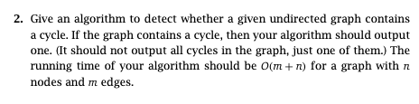
			- Run BFS on the graph and mark the predecessor of each newly explored node. When we reach a node $p$ that already has a predecessor, we have a cycle. Backtrack from the node right before the collision and add all nodes visited on the route to a vector. Once we've added $p$ to our vector, output all nodes in the vector. This is our cycle!
		- Ch. 3, Ex. 4
		- Ch. 3, Ex. 5
		- Ch. 3, Ex. 6
		- Ch. 3, Ex. 7
		- Ch. 3, Ex. 9
		- Ch. 3, Ex. 10
		- Ch. 3, Ex. 12
## 5/28: [[Dynamic Programming]]
	- Recursive Fibonacci
	  collapsed:: true
		- If you wanted to write an algorithm that calculated the $n$th Fibonacci number, you might do it like this:
		-
		  ```cpp
		  		  		  		  		  int Fib
		  		  		  		  		  ```
		- The recurrence relation for this function is $f(n) = f(n-1) + f(n-2) + \Theta(1)$
		- The runtime is difficult to calculate, but it's **really** bad.
	- What is [[Memoization]]?
	  collapsed:: true
		- The process of writing down intermediate result to refer to later.
	- [[Weighted Interval Scheduling]]
	  collapsed:: true
		- What is the optimal solution for this instance?
		  collapsed:: true
			- 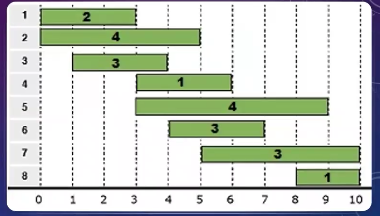
			- 2, 7 or 3, 6, 8
		- Find a Recursive Solution for [[Weighted Interval Scheduling]]
		  collapsed:: true
			-
			  ```cpp
			  			  			  			  			  int WIS(int i)
			  			  			  			  			  	if i > n Then Return 0
			  			  			  			  			  	x = WIS(i+1)
			  			  			  			  			  	y = v[i] + WIS(S)
			  			  			  			  			  	return max(x, y)
			  			  			  			  			  ```
			- We can calculate the first interval $j$ where $s_j \ge f_i$, for all $i$, before we start the recursive procedure, and store them in an array $S[1:n]$.
		- Applying [[Dynamic Programming]] to [[Weighted Interval Scheduling]]:
		  collapsed:: true
			- Transform into an iterative solution
			- We will re-envision `WIS(i)` as an array, not a function.
			- `W[i]` will store exactly what `WIS(i)` would have returned.
			- We need to determine the order to fill this array, so that we have what we need, when we need it.
			- That's actually quite easy in basic dynamic programming problems: its always reverse order.
			- We'll calculate `W[n+1]` (our base case), then `W[n]`, then `W[n-1]`, etc.
		- How to write your solutions?
		  collapsed:: true
			- State what parameters your function/array accepts, what those parameters mean, and what value it is calculating/storing specifically
				- `W[i] stores the largest value attainable on job i through n`
			- Give the recursive formula to calculate the intended output.  This is the hardest step.
				- `W[i] = max(W[i+1], v[i] + W[S[i]])`
			- Give the base case(s) for your recursive formula
				- `W[n+1] = 0`
			- State what order you fill the array in.
				- `for i = n to 1 calculate W[i]`
			- State where the answer is stored in your final array
				- `return W[1]`
	- The *Design Process* of [[Dynamic Programming]]
		- Reduce the problem to a series of ordered, bite-size decisions.
		- Figure out what subproblem(s) you will have to solve, based on each possible outcome of the bite-sized decision.
		- Represent those subproblems with as few input parameters to your recursive function as possible (more parameters = more complicated, and more runtime)
		- Design the complete recursive procedure
		- Figure out the order you will need to solve each subproblem, so that you have what you need, when you need it.
		- Figure out what indices of the array will store the final answer.
		  Design the complete iterative procedure
	- Longest Increasing Subsequence Problem
	  collapsed:: true
		- Given a sequence of numbers $s_1, \dots, s_n$ delete the fewest numbers possible so that what is left is in increasing order.
		  background-color:: #787f97
		- We’ll loop over all numbers that come after $s_i$, and consider them if they are also greater than $s_i$.
		- `LIS(int i)` returns the length of the longest increasing subsequence that uses $s_i$ as its first number.
		- $LIS(i)= 1 + \max_{k : k > i, s_k > s_j}LIS(k)$
	- [[Pseudo-Polynomial Runtimes]]
	  collapsed:: true
		- When you say a runtime is "polynomial" or "linear" or "logarithmic", that has to be in relation to something.
			- It means in relation to the length of the input.
		- When you have a $\Theta(m+n)$ graph algorithm, that's a linear runtime, because the size of the graph (which is the input) is $m+n$.
			- I could introduce a new variable $X$ such that $\log X = m+n$. It would be correct to say the runtime is $\Theta(\log X)$. That does not somehow make the runtime logarithmic.
	- What is the runtime of the [[Primality Algorithm]]?
	  collapsed:: true
		- The runtime of is $\Theta(X)$. However, this is not a polynomial runtime.
		- The length of the input is $n = \log X$.
			- So the runtime is $\Theta(X) = \Theta(2^{\log X}) = \Theta(2^n)$
			- Thus the algorithm was exponential, even though it looked linear.
	- The [[Coin-Changing Problem]]
		- What should my first decision be?
			- "What coin do I choose next?"
		- What should the parameters of my function be?
		  collapsed:: true
			- I need to know the remaining target I am aiming to sum to.
			- $CC(x)$ will return the fewest number of coins needed to make $x$ cents change.
		- If I choose denomination $d_i$, what recursive call should I make?
		  collapsed:: true
			- $CC(x-d_i)$
		- What should our recursive formula be?
			- We need to consider every possible denomination
			- $CC(x) = 1 + \min_{i: d_i \le x} CC(x-d_i)$
		- What is our base case?
		  collapsed:: true
			- $CC(0) = 0$
		- Pseudocode 
		  collapsed:: true
			- 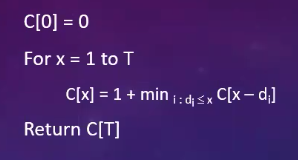{:height 181, :width 327}
		- What is the runtime of the dynamic programming solution?
		  collapsed:: true
			- $\Theta(nT)$
			- However, this is not polynomial since $T$ is not the size of the input.
			- $\Theta(nT) = \Theta(n \cdot 2^{\log T})$ where $\log T$ is the size of the input $T$. So this is actually exponential.
	- The [[Assembly-line Scheduling Problem]]
	  collapsed:: true
		- What should our bite-size decision be?
		  collapsed:: true
			- "Do I stay on the same line, or switch to the other line?"
		- What information do I need to pass into the function as input parameters?
		  collapsed:: true
			- The current station we're at, which is represented by two values: line and station number.
		- $ALS(i, j)$ will return the length of the shortest path that starts at $S_{i,j}$.
		  collapsed:: true
			- $ALS(1,j) = a_{1,j} + \min(ALS(1, j+1), t_{1,j} + ALS(2, j+1))$
			- $ALS(2,j) = a_{2,j} + \min(ALS(2, j+1), t_{2,j} + ALS(1, j+1))$
			- $ALS(i, n) = a_{i,n}$
		- Pseudocode
		  collapsed:: true
			- 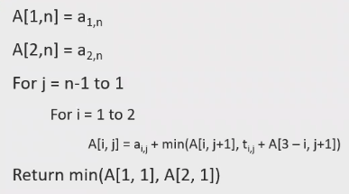
		- What is the runtime?
		  collapsed:: true
			- $\Theta(n)$
	- The [[Sequence Alignment Problem]]: How to efficiently calculate the [[Edit Distance]]?
		- Bite-size Decision
		  collapsed:: true
			- "Do I match $x_i$ and $y_j$?
			- There are a few options:
				- Match the letters
				- Transform $x_i$ to $y_j$
				- Delete $x_i$
				- Add $y_j$
		- What do we need to keep track of in our call so Sequence Alignment?
		  collapsed:: true
			- $SA(i,j)$, where $i$ is the current character of $X$, and $j$ is the current character of $Y$.
		- What will $SA(i,j)$ return?
		  collapsed:: true
			- The edit distance of $X = x_i \dots x_n$ and $Y = y_j \dots y_m$
		- What is the recursive formula for $SA(i,j)$
		  collapsed:: true
			- If $x_i = y_i$, then we return $SA(i+1,j+1)$. It is possible to formally prove that is always optimal
			- If we decide to transform $x_i$ into $y_j$, we return $1 + SA(i+1, j+1)$
			- If we remove $x_j$, we return $1 + SA(i+1, j)$
			- If we add $y_j$, we return $1+SA(i,j+1)$
			- $SA(i,j) = SA(i+1,j+1)$, if $x_i = y_j$
			- $SA(i,j) = 1 + \min(SA(i+1, j+1), SA(i, j+1), SA(i+1, j))$, otherwise
		- Base case:
		  collapsed:: true
			- $SA(i, m+1) = n-i+1$
			- $SA(n+1, j) = m - j + 1$
		- What order do we need to fill the array?
		  collapsed:: true
			- 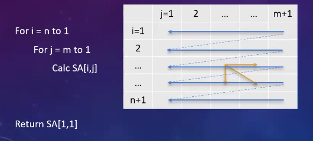
		- Runtime
		  collapsed:: true
			- $\Theta(mn)$
		- Space
		  collapsed:: true
			- $\Theta(mn)$
		- How could we improve the space requirement?
		  collapsed:: true
			- We only need the current column and the previous column.
			- $\Theta(n)$
	- The [[Subset Sum Problem]]
	  collapsed:: true
		- What should my bite-size decision be?
			- Do I include the current integer. $w_i$ or not?
		- What information do we need to pass into the parameter?
			- $SS(i, x)$, where $i$ is the current integer, and $x$ is the remaining target
			- $SS(i, x)$ returns $1$ if there is a subset of $w_1, \dots, w_n$ that add exactly to $x$, and $0$ otherwise.
		- If I include $w_i$, what is my recursive call?
			- $SS(i+1, x-w_i)$
		- If I don't include $w_i$, what is my recursive call?
			- $SS(i + 1, x)$
		- What base cases do I need?
			- $SS(i, 0) = 1$
			- $SS(n+1, x) = 0$, for $x \ne 0$
			- $SS(i,x) = \max(SS(i+1, x-w_i), SS(i+1, x))$
		- How to fill in the array?
		  collapsed:: true
			- 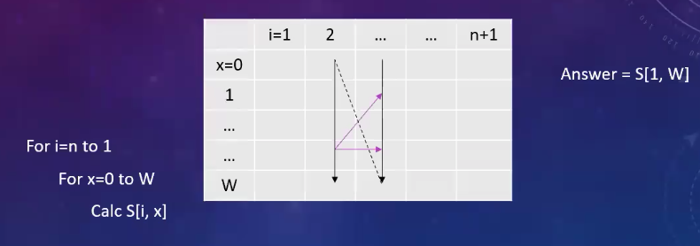
		- Runtime
		  collapsed:: true
			- $\Theta(nW)$
		- Is this a polynomial runtime?
		  collapsed:: true
			- No, $W$ is not size.
	- Finding [[RNA Secondary Structure]]
	  collapsed:: true
		- How [[Ribonucleic acid (RNA)]] bonds with itself is very complicated.
		- We will simplify it, getting an approximation of how it looks.
		- We will be reconstructing one of the first algorithmic attempts to predict [[RNA Secondary Structure]].
		- We want to identify $S$, the set of pairs for input string $B$.
		- We will assume that [[Ribonucleic acid (RNA)]] always follows these rules:
			- Each pairing is $AU$ or $CG$
			- If $\langle b_i, b_j \rangle \in S$, then $i < j-4$ (the ends of each pair are separated by 4+ bases)
			- If $\langle b_i, b_j \rangle$, $\langle b_k, b_l \rangle \in S$, it is not the case that $i < k < j < l$ (no crossed pairs)
			- We will assume RNA forms the maximum possible pairs subject to the above rules.
		- Bite-size Decisions
			- What, if anything, do I pair with $i$?
		- Suppose $b_1$ pairs with $b_{n/2}$. What sub problems do I need to worry about?
			- 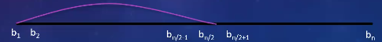
			- $[b_2, b_{n/2 - 1}] \cup [b_{n/2+1}, b_n]$
		- What parameters do we need to pass into out function?
			- $RNA(i, j)$ returns the max possible matched pairs on the substring $b_i \dots b_j$.
		- If $b_i$ doesn't pair with anything, what recursive call should we make?
			- $RNA(i+1, j)$
		- If $b_i$ pairs with $b_k$, what is my recursive formula?
			- $1 + RNA(i+1, k-1) + RNA(k+1, j)$
		- I try all possible $k$, and take the best option:
			- $RNA(i,j) = \max(RNA(i+1, j), 1 + \max_k (RNA(i+1, k-1) + RNA(k+1, j)))$
		- Considering the valid choices for $k$, the full recursive formula is
			- $RNA(i,j) = \max(RNA(i+1, j), 1 + \max_{k : k > i+4, \{b_j, b_k\} = \{A, U\} or \{C, G\}} (RNA(i+1, k-1) + RNA(k+1, j)))$
			- $RNA(i,j) = 0$, if $i \ge j-4$
		- What order do we fill the array in?
			- 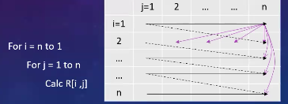
	- The [[Shortest Path Problem]]
	  collapsed:: true
		- We are going to find the shortest path on a graph with negative edges, which [[Dijkstra's Algorithm]] cannot do.
		- While we will allow negative-weight edges, we will disallow negative-weight cycles, as this produces nonsensical answers.
		- Bite-size decision:
			- What node do I go to next?
		- Input parameters:
			- The current node.
			- How many edges have been traversed. We will use this to determine whether we are in an infinite cycle. If we traversed more edges than necessary, then we will stop.
		- $SP(i, x)=$ The length of the shortest path from $x$ to $t$, using no more than $i$ edges.
			- $SP(i,t) = 0$, for $i > 0$
			- $SP(0,x) = \infty$, for $x \ne t$
			- $SP(i,x) = \min _{(x,y)\in E}(c_{\langle x,y \rangle} + SP(i-1,y))$
		- What values should I initially pass into this function?
			- $SP(n-1,s)$
		- Which order to fill the array in?
			- 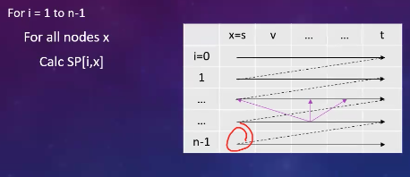
	- Finding Negative-Weight Cycles
	  collapsed:: true
		- If $SP[i,x] = SP[i+1,x]$, for all $x$, then there are no more updates to be made for larger values of $i$.
		- If $SP[n-1,x] \ne SP[n,x]$, then there must exist a negative-weight cycle!
	- Finding All-Pairs [[Shortest Path Problem]]
	  collapsed:: true
		- Suppose we want to return the shortest path between *all* pairs of points.
			- So we will return $n(n-1)$ answers, one for each pair.
		- $ASP(i,x,z) =$ the length of the shortest path from $x$ to $z$, using no more than $i$ edges.
		  collapsed:: true
			- $ASP(i,z,z)=0$
			- $ASP(0,x,z) = \infty$, for $x \ne z$
			- $ASP(i,x,z) = \min_{\langle x, y \rangle \subset E} (c_{\langle x, y \rangle} + ASP(i-1, y, z))$
			-
			  ```cpp
			  for i=1 to n-1
			  	for all nodes z
			      	for all nodes x
			          	calc ASP[i,x,z]
			  ```
	- Extra Practice
		- Ch. 6, Ex. 1, 4, 6, 19, 20, 24, 26, 27
## 6/9: Greedy Algorithm
- What is a [[Greedy Algorithm]]?
	- A [[Greedy Algorithm]] is very much like a [[Dynamic Programming]] algorithm, with one significant difference.
	- A [[Dynamic Programming]] algorithm says "there's a bunch of choices, I don't know which one is correct, let's try them all and take the best!"
	- A [[Greedy Algorithm]] says "there's a bunch of choices, but I only need to try this specific one."
	- For example, [[Kruskal's Algorithm]] and [[Dijkstra's Algorithm]] are [[Greedy Algorithm]].
- The [[Exchange Argument]]
  collapsed:: true
	- What does it mean for our first choice to be correct?
		- There is an optimal solution which includes our first choice.
		- There may be many optimal solutions, we just care that one of them includes this choice. If none do, our choice was clearly wrong.
	- So if our first choices are correct, there must be an optimal solution that includes both of our first two choices.
		- Our inductive hypothesis will (always) be "there is an optimal solution, called $OPT$, that includes our first $k$ choices."
		- Our inductive step will be to find an optimal solution, call $OPT'$,that includes our first $k+1$ choices.
		- Our base case will always be simple: "there is an optimal solution that includes our first 0 choices."
- [[Sequential Exchange Arguments]]
  collapsed:: true
	- There is an optimal solution which includes our first 0 choices
	- Assume there is an optimal solution OPT which includes our first $k$ choices.
	- Swap something in OPT without $(k+1)$st choice to produce OPT'
		- Figuring out what to swap is a large part of the challenge
		- Simply saying "OPT's $(k+1)$st choice is meaningless. OPT is a solution. It includes some choices, and not others. IT doesn't specify the order to choose those choices, because the order is irrelevant to whether or not the solution is optimal.
		- You **can** impose an order on OPT's choices (such as sorting them by finish time), and use that to bring meaning to the phrase "OPT's $(k+1)$st choice."
	- Prove that OPT' is still valid, that is it doesn't break any rules of the problem
	- Prove that OPT' is still optimal, that is it still optimizes the solution
- Proof of the [[Kruskal's Algorithm]]
  collapsed:: true
	- The [[Cycle Property]] states that the largest-cost edge in a cycle is not in the [[Minimum Spanning Tree]]
	- B.C.: There is an optimal solution that includes out first 0 edges from Kruskal's Algorithm (KA)
	- I.H.: Assume there is an OPT solution that includes the first $k$ edges from KA.
	- I.S.: KA includes edge $i$ next: assume that OPT does not include this edge.
		- $OPT+i$ creates a cycle $C$. Since KA included edge $i$, there must be another edge in the cycle, $j$, that KA didn't include.
		- It must be that $c_j \ge c_i$, because otherwise we would have considered, and included, $j$ instead of $i$.
		- $OPT' = OPT + i-j$ costs no more than OPT, so it is optimal.
		- $OPT'$ has $n-1$ edges, because we added one and removed one.
		- $OPT'$ is connected: any pair of nodes that used edge $j$ can use the rest of cycle $C$ as a detour instead.
		- Therefore, $OPT'$ is still a tree, and thus is valid.
- Proof of the [[Prim's Algorithm]]
  collapsed:: true
	- The [[Cut Property]] states that for any partition $\langle P, V-P \rangle$ of the vertices, the cheapest edge spanning the partition is in the [[Minimum Spanning Tree]]
	- B.C.: There is an optimal solution that includes the first 0 edges from Prim's Algorithm.
	- I.H.: PA includes edge $i$ next: assume that OPT does not include this edge (otherwise we're done)
		- $OPT+i$ creates a cycle $C$. Since PA included edge $i$, all other edges spanning the discovered and undiscovered nodes must cost at least as much.
		- Since part of $C$ is in the discovered nodes, and the rest is in the undiscovered nodes, there must be another edge $j$ in $C$ that spans the partition.
		- $c_j \ge c_i$, because otherwise PA would have included $j$ instead of $i$.
		- $OPT' = OPT+i-j$ costs no more than $OPT$, so it is optimal.