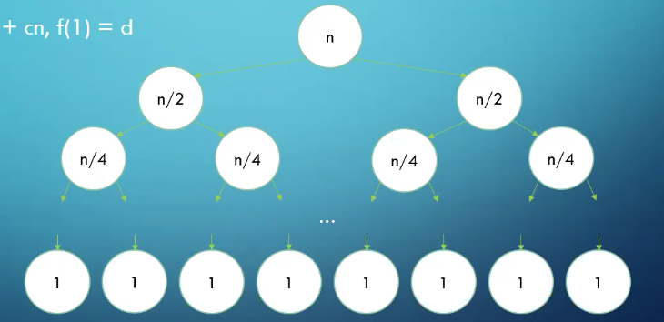
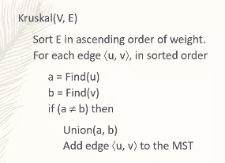

- :title:: CSCI 270: Introduction to Algorithms and Theory of Computing
- #[[University of Southern California]]
- 5/19: Introduction
	- [[The Famous Person Problem]]
	  collapsed:: true
		- Person $p$ is **famous** iff everyone in this class knows *p*, but *p* knows no one else in this class.
		- A single *query* consists of taking a pair of people $<p, q>$ from the class, asking if $p$ knows $q$, and receiving a response.
		- You want to determine all the famous people in a class of size $n$, using the minimum possible number of queries.
		- How would we test this hypothesis? 
		  collapsed:: true
			- For every person in the class, ask if they know me, and if I know them. If any queries fail, I'm not famous. Otherwise, I am.
		- How would we alter our test to find all famous people in the class?
		  collapsed:: true
			-
			  ```cpp
			  			  			  For all people in the class p
			  			  			  	For all people in the class q, where p != q
			  			  			    	If p knows q, then p is not famous
			  			  			    	If q doesn't know p, then p is not famous
			  			  			    If p is famous, add p to the list
			  			  			  Return our list
			  			  			  ```
			- How many queries does this algorithm use, exactly?
			  collapsed:: true
				- $2n(n-1)$
		- How can we improve our algorithm?
		  collapsed:: true
			- We’re asking each query twice.  If we are clever about how we organize our queries, we can reduce this to $n  \ne (n-1)$ (or, $n \text{ permute } 2$) queries.
			- The queries are "does $q$ know $p$?", and "does $p$ know $q$?". However, eventually $p$ and $q$ switches value, so we are asking the same queries twice.
		- How many famous people can there be, maximum?
		  collapsed:: true
			- One. Two would have to both know and not know each other, so we can stop the algorithm after finding our first famous person.
		- An even better solution:
		  collapsed:: true
			- If $p$ knows $q$, then we know that $p$ is not famous.
			- If $p$ does not know $q$, then we know that $q$ is not famous.
			-
			  1. Maintain a list of famous candidates, initially everyone
			  2. Take any pair $<p, q>$ from the list, or go to step 5
			  3. Check if $p$ knows $q$. If so, remove $p$. Otherwise, remove $q$.
			  4. Return to step 2
			  5. There is one person on the list now: $c$
			  6. For all people $q \ne c$:
				- Check if $c$ knows $q$. If so, return `nullptr`.
				- Check if $q$ knows $c$. If not, return `nullptr`.
				-
				  7. Return $c$.
				- But $c$ is not necessarily famous.
				- Improve the algorithm for the Famous Person Problem to require only $3 \cdot (n-1) - \log_2 n$ queries.
				- Prove that the Famous Person Problem cannot be solved with less than $\Theta(n)$ queries.
				  collapsed:: true
				- To determine for sure whether a candidate $p$ is for sure a famous person, we have to ask if $p$ knows $q$ for each $q$ in the class, which will take $n-1$ time. Thus, we will always have to ask at least $\Theta(n)$ queries.
- 5/20: Proof and Runtime
	- Prove by contradiction: if $n^2$ is odd, then $n$ is odd.
	  collapsed:: true
		- Assume that $n^2$ is odd and $n$ is even.
		- $n = 2k$
		- Therefore, $n^2 = 4k^2$, which is even. Contradiction!
	- Prove by contradiction: there are an infinite number of primes.
	  collapsed:: true
		- Assume that there are a finite number of primes.
		- Therefore, there is a largest prime, $p$.
		- $p!$ is divisible by all primes $\le p$
		- Therefore, $p! + 1$ is divisible by no primes $\le p$
		- However, Every number has a prime factorization, so either $p! + 1$ is prime (and larger than $p$) or its prime factorization contains primes only larger than $p$. Contradiction!
	- Prove or disprove: for any sets $A$, $B$, and $C$, if $A \times C = B \times C$, then $A = B$. 
	  collapsed:: true
	  $(A\times B = \{\langle a,b \rangle : a \in A, b \in B\})$
		- Wrong Proof:
		  collapsed:: true
			- Assume $A \times C = B \times C$, but $A \ne B$
			- There must be an element in one of $A$ or $B$ which is not in the other set.
			- Without loss of generality, assume $a \in A$, but $a \not\in B$
			- Choose an arbitrary element $c \in C$
			  id:: 60a7b70a-4dee-4f36-b675-5c79c6547d60
			- $\langle a,c \rangle \in A \times C$, but $\langle a,c \rangle \not\in B \times C$, contradiction!
		- However, when we said: ((60a7b70a-4dee-4f36-b675-5c79c6547d60)), we falsely assumed that there is an element in $C$.
		- Correct Proof:
		  collapsed:: true
			- Counter-example: when $C = \phi$, $A \times C = B \times C$ even when $A \ne B$.
	- Proof by [[Induction]]: find the flaw in the proof that $a^n=1$, for all non-negative integers $n$ and all non-zero reals $a$.
	  collapsed:: true
		- _Base Case_: $a^0 = 1$
		- _Inductive Hypothesis_: $a^n = 1$, for all $n \le k$
		- _Inductive Step_: $a^{k+1} = \frac{a^k \cdot a^k}{a^{k-1}} = 1$, by the inductive hypothesis
		- **The problem**: When we are looking at $k = 0$, because it refers to $a^{-1}$, which we haven't proven (and can't).
	- Runtime of Mergesort
	  collapsed:: true
		- $f(n) = 2 \cdot f(n/2) + x \cdot n, f(1) = y$
		- Hypothesize that $f(n) \le c \cdot n \log n$, for all $n \ge 2$
		- _Base Case_: We need $f(2) = 2 \cdot y + 2 \cdot x \le 2 \cdot c$. Choose $c$ to be $\ge x + y$.
		- _Inductive Step_: by the inductive hypothesis, 
		  $$
		  f(k + 1) = 2 \cdot f(\frac{k+1}{2}) + x \cdot (k+1) \le 2c \cdot \frac{k+1}{2} \log \frac{k+1}{2} + x \cdot (k+1) \\
		  = c(k+1)[\log(k+1) - 1] + x(k+1) \\
		  = c(k+1)\log(k+1) + (x - c)(k+1)
		  $$
		- So the claim is true when $(x-c)(k+1) \le 0$, which is true when $c \ge x$
		- It is, since we already chose $c$ to be $\ge x + y$. Proven!
		- Does this prove that Mergesort takes $Theta(n \log n)$?
			- No, we only showed $O(n\log n)$. We'd need another proof to show $\Omega(n \log n)$
		- Is it valid to use $n=2$ as the base case?
			- Yes, because O-notation asserts the claim is true for all $n \ge n_0$. We can choose $n_0 = 2$.
	- Solve-by-tree
	  collapsed:: true
		- $f(n) = 2f(n/2) + cn, f(1) = d$
		- 
- 5/21: Master Theorem
	- What can [[Master Theorem]] do?
	  collapsed:: true
		- Master Theorem can solve (almost) any recurrence relation of the form
		- $f(n) = a \cdot f(n/b) + g(n)$, for constants $a \ge 1$ and $b > 1$
	- Using the [[Master Theorem]]:
	  collapsed:: true
		- Given $f(n) = a \cdot f(n/b) + g(n)$, for constants $a \ge 1$ and $b > 1$, compare $g(n)$ with $n^{\log a / \log b}$
			- Case 1: If $g(n) = \Theta(n^{\log a / \log b})$, then $f(n) = \Theta(g(n) \cdot \log n)$
			- Case 2: If $g(n) = \Omega(n^{(\log a / \log b) + \epsilon})$ for some $\epsilon > 0$, then $f(n) = \Theta(g(n))$
			- Case 3: If $g(n) = O(n^{(\log a / \log b) - \epsilon})$ for some $\epsilon > 0$, then $f(n) = \Theta(n^{\log a / \log b})$
	- More Precise Interpretation of [[Master Theorem]]
	  collapsed:: true
		- If the work done on the bottom level is a **polynomial-factor** bigger than the work on the top level, then the total work is the work on the bottom level.
		- If the work done on the top level is a **polynomial-factor** bigger than the work on the bottom level, then the total work is the work on the top level.
		- If the difference between the top and bottom level is greater than a constant, but smaller than a polynomial, then master theorem **will not help us**.
	- What is [[Amortized Runtime]]?
	  collapsed:: true
		- It is a blend between average-case and worst-case. It is kind of the "worst-case average-case".
	- Practice:
		- Prove for all integers $n$: $n$ is odd iff $3n+1$ is even.
		  collapsed:: true
			- $n = 2k+1$
			- $3(2k+1)+1 = 6k+3+1 = 6k+4 = 2(3k+2) = 2c$, which is even.
		- Use induction to prove that $\sum^n_{i=0} \frac{1}{2^i} < 2$
		  collapsed:: true
			- _B.C._: For $n = 0$, $\sum^0_{i=0} \frac{1}{2^i} = \frac{1}{2^0}  = 1 < 2$
			- _I.H._: Assume $\sum^n_{i=0} \frac{1}{2^i} < 2$ for $n \le k$
			- _I.S._: Consider $n = k + 1$, 
			  $$
			  \sum^{k+1}_{i=0} \frac{1}{2^i}  = \frac{1}{2^{k+1}} + \sum^{k}_{i=0} \frac{1}{2^i} < \frac{1}{2^{k+1}} + 2 < 2
			  $$
		- Chapter 2, exercises 3, 4, 5, 6
		- Challenge: Chapter 2, exercise 8
		- Solve the following recurrence relations:
			- $f(n) = f(n/4) + \sqrt{n}$
			- $f(n) = f(n/4) + 1$
			- $f(n) = f(n/4) + \log n$
- 5/24: [[Union-Find ADT]]
	- [[Spanning Tree]]
		- Given a connected, undirected graph $G$, a **spanning tree** is a subset of the edges which form a tree on the original nodes.
	- [[Minimum Spanning Tree]]
		- Given a connected, undirected graph $G$, a **minimum spanning tree** is the [[Spanning Tree]] which minimizes the sum of the edge weights.
	- Kruskal's Algorithm
		- [[Kruskal's Algorithm]] adds edges from smallest to largest value, unless adding an edge creates a cycle. It provably find the [[Minimum Spanning Tree]] .
	- Implementing [[Kruskal's Algorithm]]
	  collapsed:: true
		- What would be the first step in the implementation of Kruskal's Algorithm?
		  collapsed:: true
			- Sort the edges.
		- What is the runtime of this step?
		  collapsed:: true
			- $\Theta(m \log m)$
		- How do we determine if an edge creates a cycle?
		  collapsed:: true
			- When adding edge $\langle u,v \rangle$, run BFS or DFS from $u$ on the MST-so-far to see if there is already a path from $u$ to $v$. If so, don't add the edge.
		- What's the runtime of this implementation?
		  collapsed:: true
			- $\Theta(mn)$. We can do better, but we're going to need a new data structure.
	- What operations do the [[Union-Find ADT]] support?
	  collapsed:: true
		- `Find(v)`, which returns which componenet node $v$ is in. If `Find(u) == Find(v)`, then we don't want to add edge $\langle u, v \rangle$.
		- `Union(u,v)`, which combines the components of node $u$ and node $v$ into the same component. We use this when we add edge $\langle u, v \rangle$.
	- 
	- Runtime of [[Kruskal's Algorithm]]
	  collapsed:: true
		- Sorting takes $\Theta(m \log m)$
		- `Find` is called $2m$ times
		- `Union` is called $n-1$ times, because there is at most $n-1$ edges on the graph
		- Runtime $= \Theta(m \log m + m \cdot Find + n \cdot Union)$
	- Implementing Union-Find
	  collapsed:: true
		- Every node points to a "parent" node that is in the same component.
		- The root of the component has no parent, and is the "captain", or "identifier", of the component.
		- Runtime
			- Union will be $\Theta(1)$, since we just assign the parent pointer.
			- Find will potentially be $\Theta(n)$, if the parent pointers form a linked list.
		- How could we modify Union to ensure the runtime of Find is minimized
			- Always point the smaller-depth tree to the larger depth tree.
			- By doing this, we reduce the runtime of Find to $\Theta(\log n)$
	- [[Kruskal's Algorithm]] Runtime
	  collapsed:: true
		- The runtime of Kruskal's was $\Theta(m \log m + m \cdot Find + n \cdot Union)$, which now simplifies to $\Theta(m \log m)$.
- 5/26: Graph Algorithms
	- Why is there no [[Comparison-Based Sorting Algorithm]] better than $\Theta(n\log n)$?
		- Given a [[Sorting Decision Tree]], the at least $n!$ leaf nodes will be the final sorted order of the list.
		- The depth of the tree must then be $\Omega(\log n!) = \Omega(n \log n)$
		- Thus, if a [[Comparison-Based Sorting Algorithm]] takes less than $\Omega(n \log n)$ time, it literally doesn't have enough time to distinguish between all the possible answers!
	- Is there such a thing as a non-comparison-based sorting algorithm that does better than $\Omega(n \log n)$?
		- There are, and one of the most famous ones is [[Radix Sort]].
	- What is the runtime of [[Radix Sort]]?
		- $\Theta(nd)$, where $d$ is the maximum number of digits in any input.
		- If you can make assumptions about the data (such as $d$ will be small), then you can do better than $n \log n$. If you can't, then $n \log n$ is the best possible.
	- How to determine whether a [[Graph]] is a [[Bipartite Graph]]?
		- Run [[Breadth-First Search]]
		- Assign the starting node Cardinal. It doesn't matter what color we choose.
		- Assign all nodes in level 1 Gold, since they have to be.
		- Assign all nodes in level 2 Cardinal, since they have to be.
		- Assign all nodes in an odd level Gold, and all nodes in an even level Cardinal.
		- If there is an edge between two nodes on the same level, then the coloring will not work.
		  background-color:: #533e7d