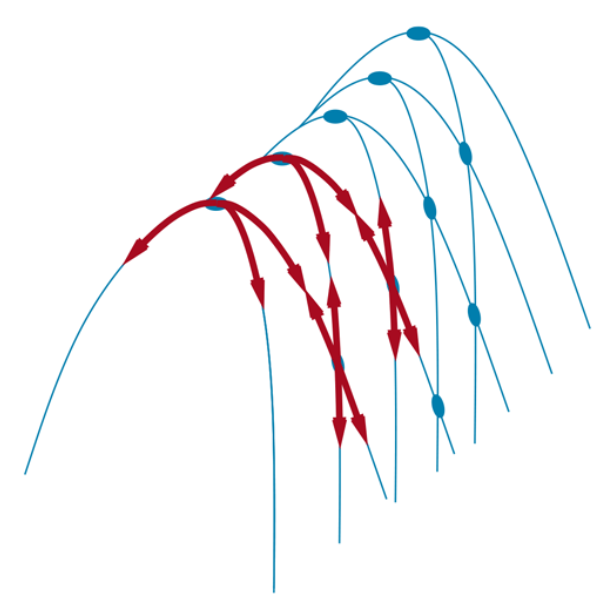

- #[[optimization algorithms]]
- Local search algorithms operate by searching from a start state to neighboring states, without keeping track of the paths, nor the set of states that have been reached.
	- Not systematic — might never explore a portion of the search space where a solution actually resides.
	- Use very little memory.
	- Often find reasonable solutions in large or infinite state spaces for which systematic algorithms are unsuitable.
- [[hill-climbing search]]
	- Greedy; heads in the direction that provides the **steepest ascent**.
	- Terminates when it reaches a "peak" where no neighbor has a higher value.
	- Can get stuck for any of the following reasons:
		- Local maxima
		- Ridges: A sequence of local maxima that are not directly connected to each other.
			- 
		- Plateaus