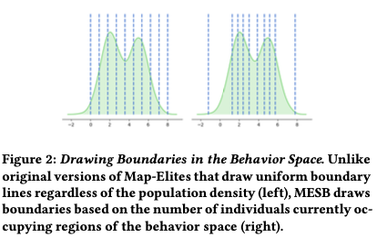

alias:: [[MAP-Elites with Sliding Boundaries]] [[MESB]] 
source:: https://arxiv.org/abs/1904.10656

- ## Main Contributions
	- a new modification of the MAP-Elites algorithm called [[MAP-Elites with Sliding Boundaries]] , this new modification of MAP-Elites introduces sliding boundaries, which allows for better handling of unequal distribution of promising solutions
	- a new application of this modification of MAP-Elites to generating decks in Hearthstone
	- several results concerning the availability of good decks in the basic and classic set of cards in Hearthstone
- ## Mutation and Fitness
	- **Mutation** is performed by replacing $k$ cards randomly from a pool of basic and classic cards that result in valid decks.
	- **Fitness** is the sum of differences in hero health over 200 games, where a positive health difference results from victory and a negative health difference results from defeat.
- ## [[MAP-Elites with Sliding Boundaries]]
	- Instead of placing boundaries uniformly by feature value, the boundaries are placed **at uniformly at percentage marks of the distribution**.
	  
	-
	-