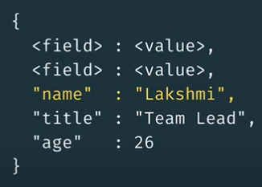

- MongoDB is a [[NoSQL]] document database, which means that data is not stored in rows and columns.
  collapsed:: true
	- Data in MongoDB is stored as documents, and documents are stored in collections of documents.
- What is a _document_?
  collapsed:: true
	- A way to organize and store data as a set of **field-value pairs**.
	- 
	- **Field** - a unique identifier for a datapoint.
	- **Value** - data related to a given identifier.
- What is a _collection_?
  collapsed:: true
	- An organized store of documents in MongoDB usually with common fields between documents. There can be many collections per database and many documents per collection.
- What is are _clusters_?
  collapsed:: true
	- group of servers that store your data.
- What is a _replica set_?
  collapsed:: true
	- a few connected machines that store the same data to ensure that if something happens to one of the machines the data will remain intact.
- What is an _instance_?
  collapsed:: true
	- a single machine locally or in the cloud, running a certain software, in our case it is the MongoDB database.
- How are documents represented in memory?
  collapsed:: true
	- Although we work with the data in [[JSON]], the data is stored as [[BSON]] in the database.
- Exporting and Importing data in BSON
  collapsed:: true
	- `mongodump --uri "<Atlas Cluster URI>"`
	- `mongorestore --uri "<Atlas Cluster URI>" --drop dump`
- Exporting and Importing data in JSON:
  collapsed:: true
	- `mongoexport --uri "<Atlas Cluster URI>" -- collection=<collection name> --out=<filename.json>`
	- `mongoimport --uri "<Atlas Cluster URI>" --drop=<filename>.json`
- What is a [[Uniform Resource Identifier (URI)]] string?
  collapsed:: true
	- In MongoDB, we use [[SRV]], which is a specific format used to establish a connection between your application and a MongoDB instance.
- What are namespaces?
  collapsed:: true
	- The concatenation of the database name and collection name is called a namespace.
	- i.e. <database>.<collection>
- How to query for documents in MongoDB?
  collapsed:: true
	- A query is a JSON object that contains the attributes that you are looking for.
	- i.e. `{"state": "NY", "city": "ALBANY"}`
- Using the Mongo Shell:
  collapsed:: true
	-
	  ```
	  // connect to the Atlas cluster
	  mongo "mongodb+srv://<username>:<password>@<cluster>.mongodb.net/admin"
	  
	  show dbs // show databases
	  use sample_training // select sample_training database
	  show collections // show collections in sample_training
	  
	  db.zips.find({"state": "NY"}) // query
	  db.zips.find({"state": "NY"}).count() // count the queries
	  db.zips.find({"state": "NY", "city": "ALBANY"}) // query
	  db.zips.find({"state": "NY", "city": "ALBANY"}).pretty()
	  ```
- How to _insert_ new documents?
  collapsed:: true
	- **Every document must have a unique `_id` value**.
	- The default value for `_id` is of `ObjectID` type unless otherwise specified.
- How to _update_ documents?
	- `db.collection.updateOne(<query>, <update operator>)`
	- `db.collection.updateMany(<query>, <update operator>)`
- Update Operators:
  collapsed:: true
	- `{"$inc": {"pop":10, "<field2>": <increment value>, ...}}` increments field value by a specific amount.
	- `{"$set": {"pop": 17630, "<field2>": <new value>, ...}}` sets field value to a new specified value.
	- `{"$push": {"<field1>": <value1>, ...}}` adds an element to an array field.
- How to _delete_ documents and collections?
	- `deleteOne()`
	- `deleteMany()`
-