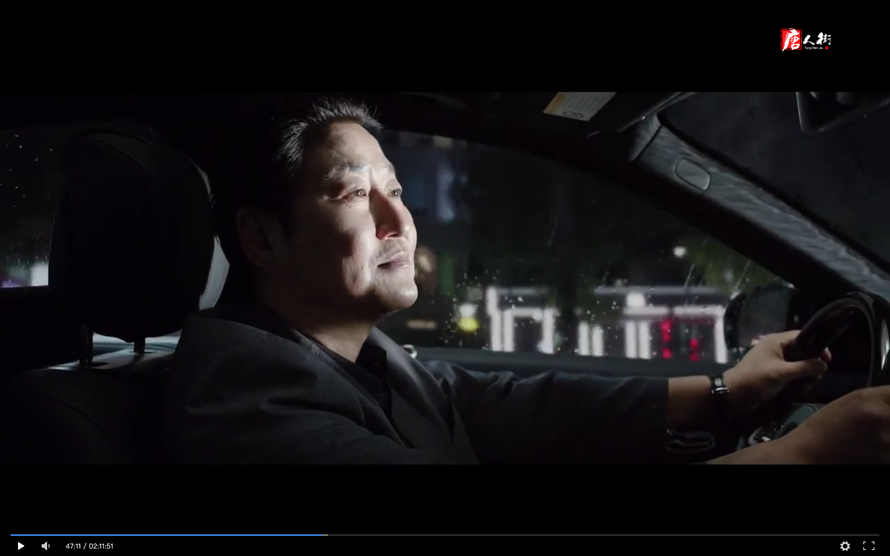

## Lighting
	- When Nathan talks about how he hates people who crosses the line, **light** shines on the Mr. Kim who is driving him.
	- 
## Framing
- The position switched when Kevin entered the Park's house
## Staging
- Use staging to show temporary ownership, or the lack thereof
## Camera
- The camera mostly follows Kevin.
- Subjective camera and objective camera in the film
- Park's return to home,