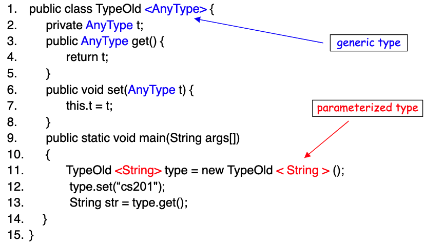

- What is unique about a [[Object-Oriented System]]?
- What makes up an [[Object]]?
- [[The Open-Closed Principle]]
	- Software modules should be open for **extension** and closed for **modification**.
- The downfall of getter/setter
- When are getter/setter acceptable?
  ---
- Three ways to design classes:
	- [[Composition]]
	- [[Inheritance]]
	- [[Interfaces]]
## Garbage Collection in Java
- What the memory locations are candidates for garbage collection?
  ```java
  ```
- What are the (2) advantages of automatic garbage collection?
	- Object creation is faster because global synchronization with the OS is not needed
	- The garbage collector reclaims the underlying memory and reuses it for future object
- What are the four ways to make an object eligible for garbage collection?
  collapsed:: true
	- Nullifying the reference variable
		-
		  ```cpp
		  Test t = new Test("t");
		  t = null;
		  ```
	- Re-assigning the reference variable
	- Object created inside method
	- Island of Isolation
- What is the [[Mark and Sweep Algorithm]]?
- How to manually invoke the garbage collector in Java?
## [[Generics]]
- What is [[Generic Programming]]?
- Why use [[Generics]]?
- How to define generic classes? 
  collapsed:: true
	- {:height 272, :width 421}
- ((61318cea-57b6-4775-8cb8-08bd4b29c202))
- What is a generic type?
	- generic type (`List<AnyType>`) is a type with formal type parameters.
- What is a parameterized type?
	- The instantiation of a generic type with actual type arguments (such as, `List<String>`).
- How to write [[Generic Methods]]?
	-
	  ```java
	  public static <T> void printArray(T[] array) {
	    for (T item : array) System.out.printf("%s", item);
	  }
	  ```
-
- What are upper bounded wildcards?
  collapsed:: true
	- The question mark (`?`), represents the wildcard, stands for unknown type in generics.
	-
	  ```java
	  public static void printList(List<? extends Number> lst) {
	    for (Number item : lst) System.out.printf("%s", item);
	  }
	  ```
- When to use upper bounded wildcards?
- What are Unbounded Wildcards?
  collapsed:: true
	-
	  ```java
	  Collection<?> col = new ArrayList<String>();
	  ```
## Arrays
- `==` only compares memory locations of objects, so we should use the function `Arrays.equals()` to compare Arrays.
- What is deep copy?
- How to compare Arrays?
- How to perform deep copy on an 1D Array?
- What happens when you call `clone()` on a 2D array?
- How to design the data structure such that we do not need to make a deep copy?
## Iterators
- What is `Iterator` and `Iterable`?
	- `Iterator` is the actual object that will iterate through a collection
	- `Iterable` is an interface which provides Iterator.
- When can you use the `foreach loop`?
	- When the class implements the interface Iterator?
- What is a `Comparable`?
	-
	  ```java
	  public interface Comparable<AnyType> {
	    public int compareTo(AnyType obj);
	  }
	  ```
- What is the `Comparator` interface?
	-
	  ```java
	  public interface Comparator<AnyType> {
	    public boolean(T obj1, T obj2);
	  }
	  ```
## Exceptions
- What are exceptions in Java?
- What options do you have after an exception is thrown? #numlist
	- do not handle it at all
	- handle it where it occurs
	- handle it later in the program
- What is the difference between **checked** and **unchecked** exceptions?
- How to define your own **checked** exception?
	- extend from `Exception` class
- How to define your own **unchecked** exception?
	- extend from `RuntimeException` class
- What is the point of the `throws` keyword?
## Java Files I/O
- What is `try-with-resources`?
	- The try-with-resources does automatic resource management. It ensures that each resource is closed at the end of the statement.
	- Resources that are to be automatically closed must be created inside the parentheses of the `try` block.
- How to read/write binary files?
	- Use `InputStream` and `OutputStream`
- What is `InputStreamReader`?
-