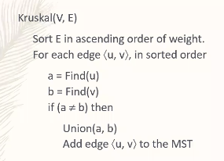

- Give [[Kruskal's Algorithm]] a significant improvement in runtime.
- Supports collection of disjoint sets.
	- `Find(v)`, which returns the name of the set containing node $v$ is in. If `Find(u) == Find(v)`, then `v` and `u` are in the same set/component, and we don't want to add edge $\langle u, v \rangle$.
	- `Union(u,v)`, which combines the components of node $u$ and node $v$ into the same component. We use this when we add edge $\langle u, v \rangle$.
- Implementation:
	- Directed forest. Root of a node is the "representative"
		- `Find(v)`: Follow pointers from $v$ to parent, until there are no more parents.
		- `Union(u, v)`: Make one of the roots of $u, v$ parent of the other.
			- To avoid creating a linked-list, always point the root of smaller tree (less nodes) to the larger tree (more nodes). Then, the height above a node can only increase when the size of the node's set at least doubles. $\implies$ max-height $\le \log n$
	- Path compression: whenever we search for the root,
- 
- Runtime
  collapsed:: true
	- Sorting takes $\Theta(m \log m)$
	- `Find` is called $2m$ times
	- `Union` is called $n-1$ times, because there is at most $n-1$ edges on the graph
	- Runtime $= \Theta(m \log m + m \cdot Find + n \cdot Union)$